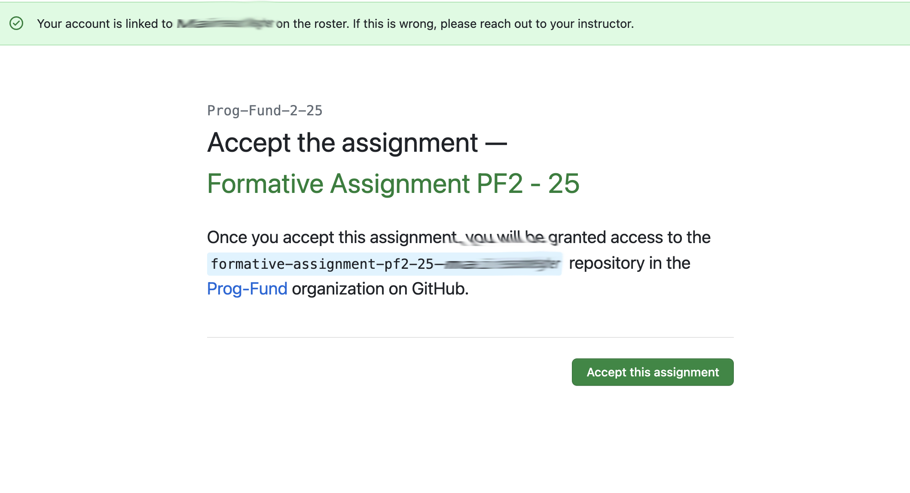
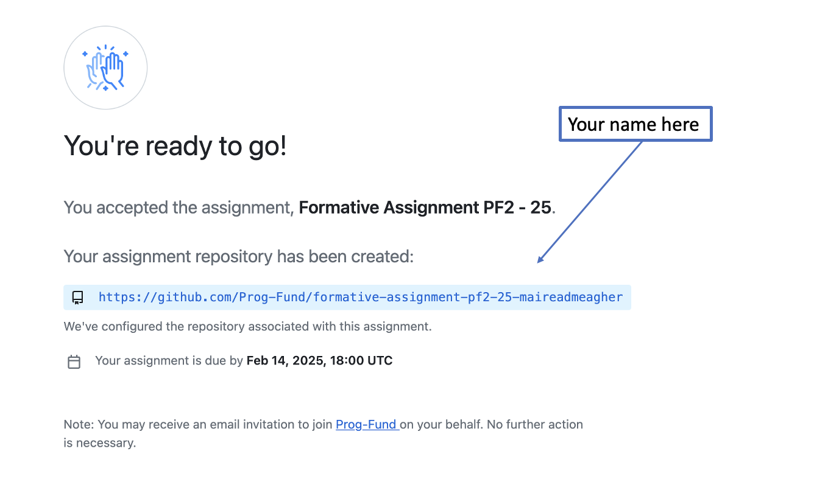

# Accepting the Assignment

The formative assignment is called **Formative Assignment PF2**.

To start working on it, click on this invite link:

<https://classroom.github.com/a/RkuXy_gg>

You will be prompted to authorise GitHub classroom - accept this and then you will be invited to Accept the Assignment

Once you do this, you will be redirected to join the classroom:

When your repository has been configured, you will be shown a list of names, one of which should be ours. Select your name from the list and then *accept this assignment*:

When you refresh the page, you should see that a repo has been created for you (your name will be at the end of the repo url):

