# IntelliJ and GitHub

You should now have a repository created in our classroom.  Click on your unique link (it will be different to our one, as it will have your GitHub user name instead of maireadmeagher):

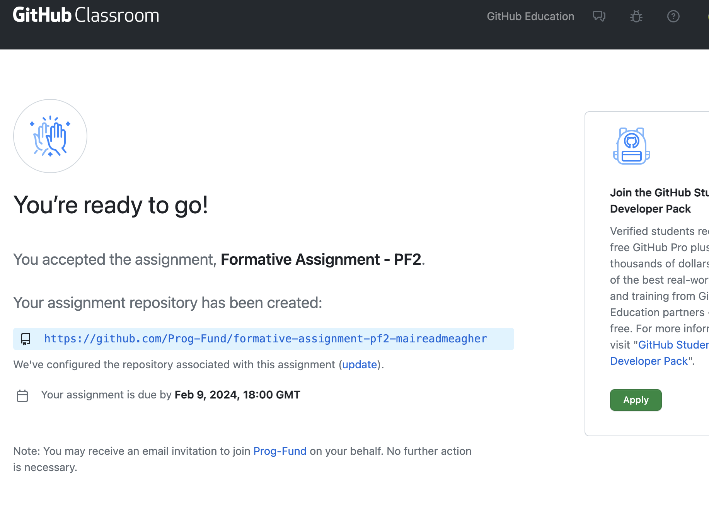

You will be taken to your remote repository where you will work on the assignment:

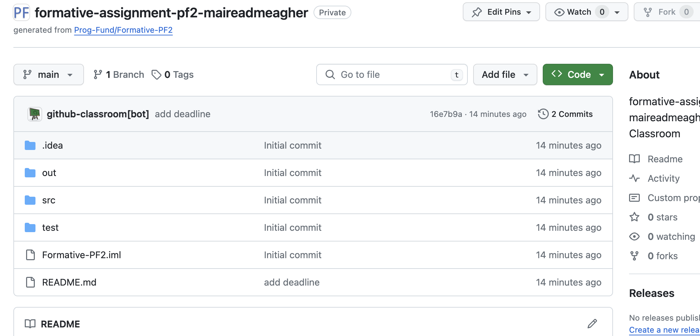

To work on the assignment, you need to download a local copy of this to your computer, via IntelliJ.

## Remote URL

In the above screen shot, you can see that the URL for **OUR** private remote repository is:

- https://github.com/Prog-Fund/formative-assignment-pf2-maireadmeagher

You WON'T have access to our URL - this is Mairead and Siobhans one.  

Instead, you use your own personal URL to the repo that was just generated.  It will be along this format i.e.:

- https://github.com/Prog-Fund/shop-product-validation-YOUR-GITHUB-ID

Make a note of **your** URL...you will need this in a few moments (and also later in the lab). If you are having trouble finding your URL, just to go your GitHub account and you should find the repo in there.

## IntelliJ: Linking to your Remote Repo

Launch IntelliJ.

When the splash screen appears, you will notice there are three options:

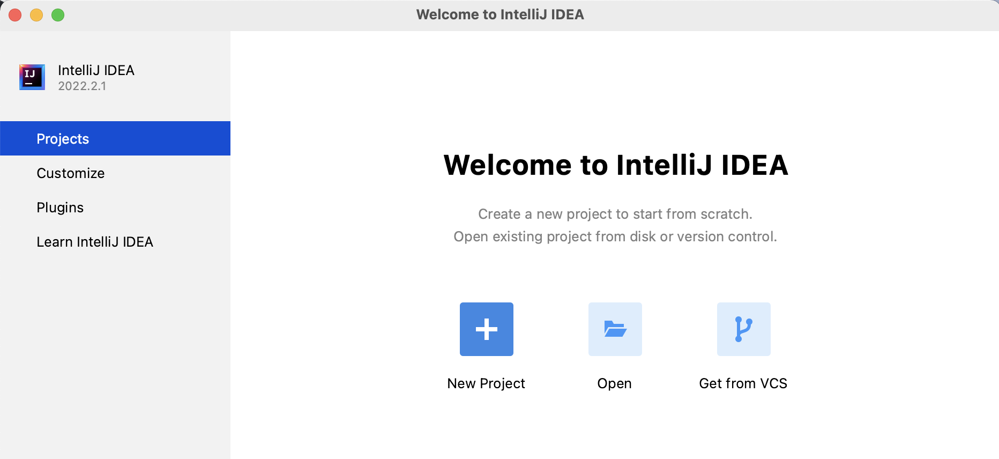

So far, you have used the first two:

- New Project
- Open

You will now use the thid option: **Get from VCS** (Note: VCS stands for Version Control Software...this is what GitHub is).

Click on the **Get from VCS** button and the following dialog will be shown:

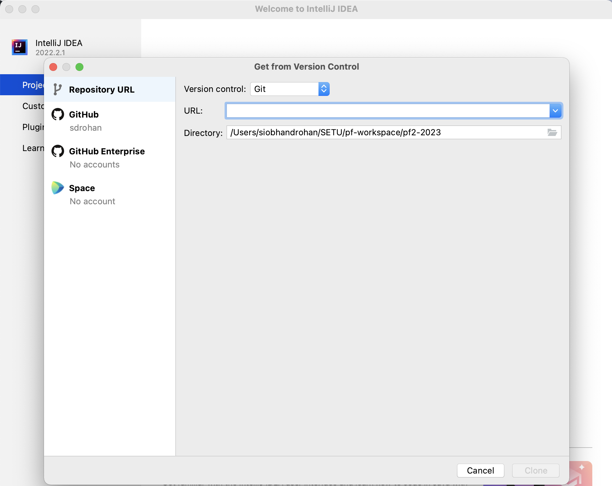

**Repository URL** should be highlighted on the left hand side of the screen.  

As you already have a starter project with starter code created for you (i.e. your remote repository in GitHub Classroom), you want to clone this to your local machine. 

In the **URL** box, enter the URL for **your** remote repository (the one you made a note of earlier):

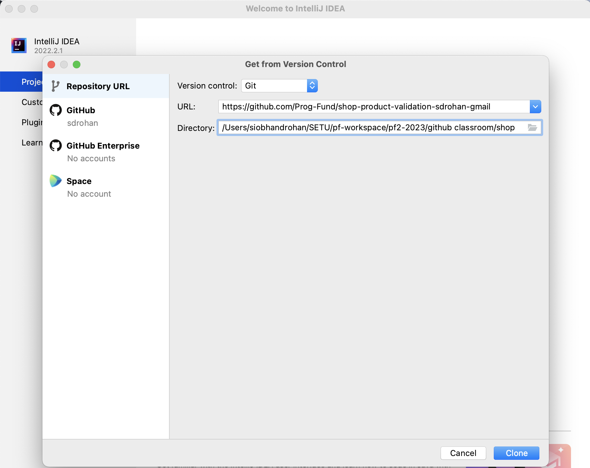

And choose a location on your computer for the local copy of the code to reside (OneDrive if you are using college computers).  

Click the **Clone** button.

You will be asked to either 'Login in via GitHub' or 'Use Token'
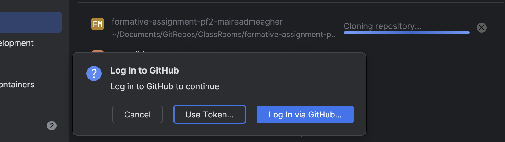

Pick the 'Use Token' option.
You will see the following:
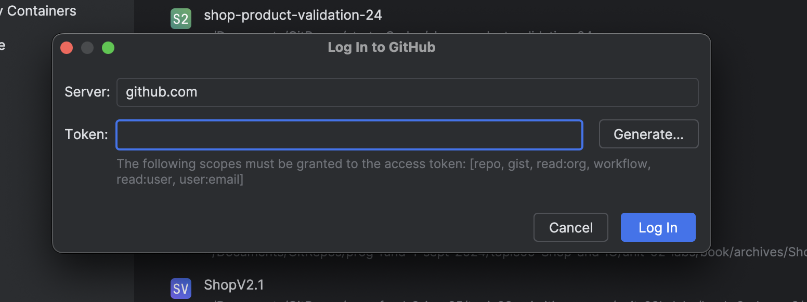

Press 'Generate'
You will be brought to the following screen: 
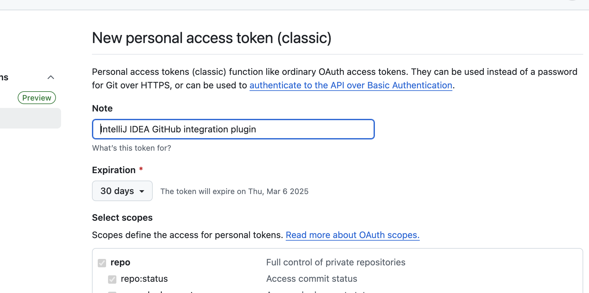
The 'IntelliJ IDEA GitHub integration plugin' note will serve as the identifier and as such will  need to be unique. 

Use a name e.g. pf2-fa-05022025    (last string is date) 
Go to the end of the page and press 'Generate Token' 
You will see the following page (or something similar) 
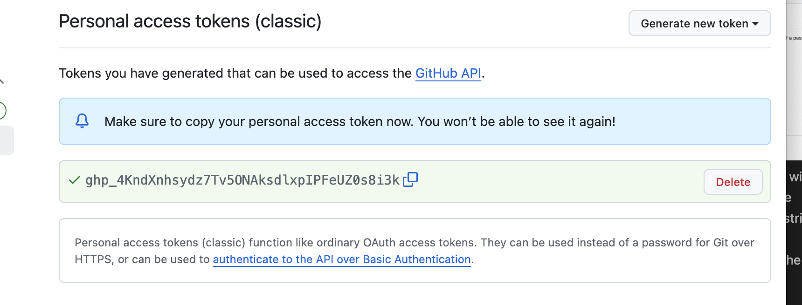

Copy this token. 

Then return to IntelliJ and paste the token into the 'Token' field.

Then press 'Login'

You may be asked if you trust the project...you do:

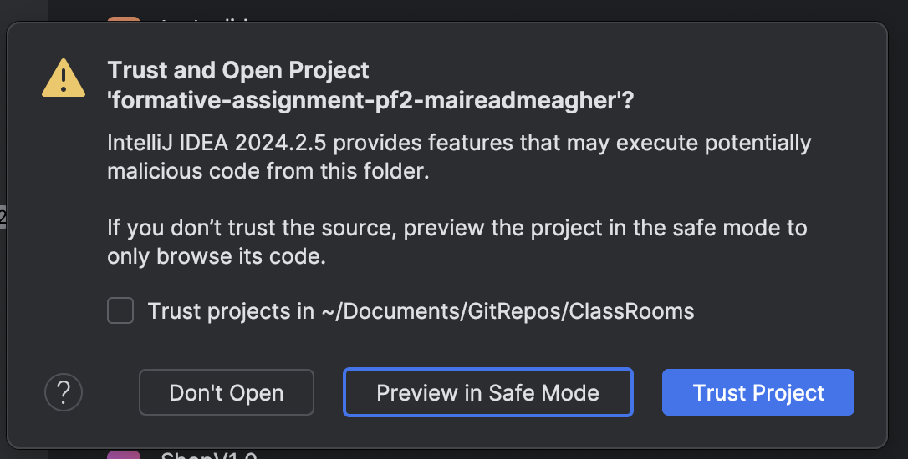

if you are asked to give access to GitHub - accept all defaults. This includes 'Authorize JetBrains'

A local copy of the remote project should now open in IntelliJ.  It should look like this...

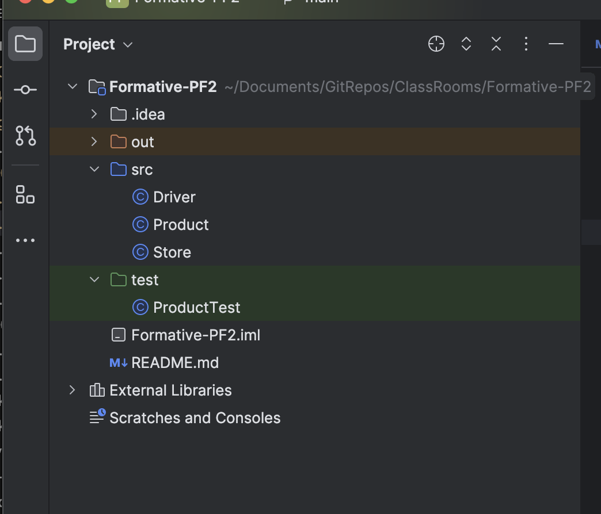

**Make sure that your project looks the same as our screen shot above before continuing.**

