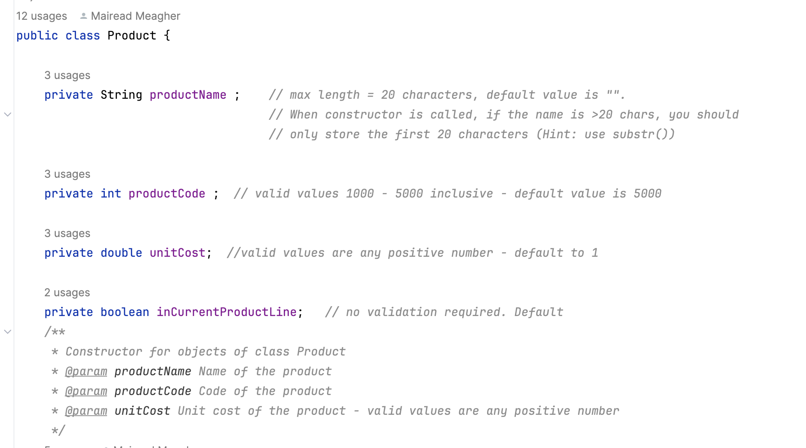

#3. Starter Code

In the screen shot below, you can see that we have three main folders in the starter project:

- `src` coloured blue
- `test` coloured green
- `lib` coloured grey (this is where our xStream component is)

 

# src folder

Source contains multiple files, located in packages i.e. folders.

## models

- **Owner**: This class is responsible for managing a single Owner.  It contains a series of TODO comments for you to work on. 
 
- **Dog**: This class is responsible for managing a single Dog. A dog can have one or more owners associated with it (i.e. an ArrayList of Owner). This class contains a series of TODO comments for you to work on.  

## controllers

- **DayCare**: This class is responsible for managing the collection of Dogs (i.e. the ArrayList of Dog). This class contains a series of TODO comments for you to work on.  

## utils
**TO BE DONE**
No work is needed in this area; all the classes are complete and ready for you to use.  

- **ScannerInput**: This is the ScannerInput class from labs.  It uses a new Scanner object for every read and also allows you to perform robust reads of numbers.

- **Helper**: This class contains a series of helper methods to validate fields e.g. check a variable is within a range, truncate a string, check a string length, etc.

**There are marks for using these utilities in your project for reading in from the user and for validating fields.**

# Driver class

In the main src folder, there is one class called **Driver** which:

- has the main method 
- runs the menu 
- is the only class that can talk to the user i.e. you will use ScannerInput only in this class and it will be the only class that has System.out.print in it.
- has some TODO comments for you to work on. 

You are free to design your own Driver menu in any way you wish, once it includes these capabilities:
- CRUD on Dog
- CRUD on Owner
- Search facility (for Dogs and Owners)
- Reports (for Dogs and Owners)
- Persistence, XML format

An example of a typical menu for this Driver could be:

 

And, based on the above menu, the typical methods in Driver could be:

**You should design your own menu and Driver methods**
