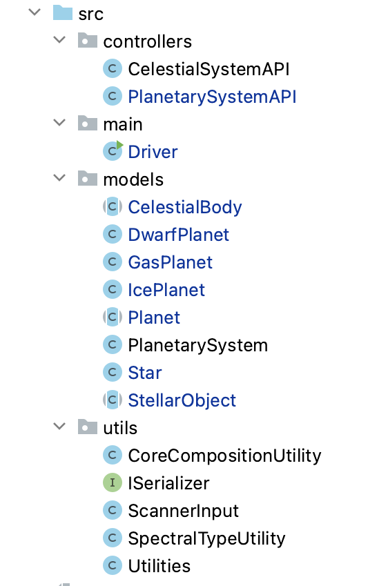
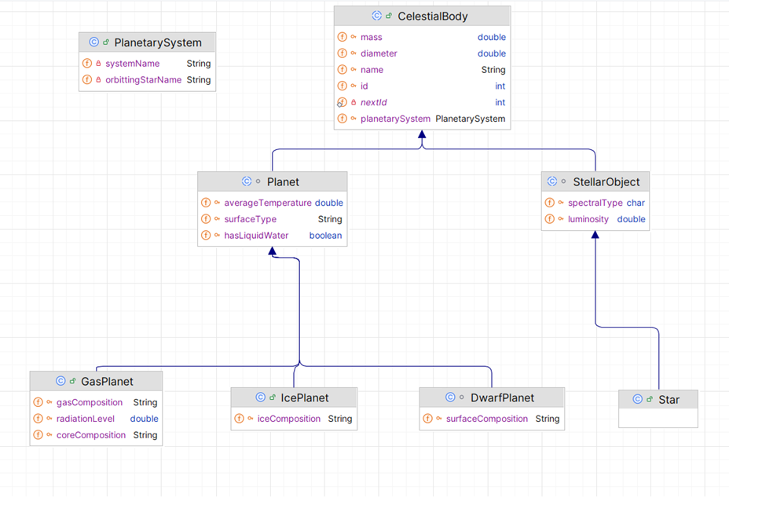

# 2. Classes Overview

The system has the follwing *src* classes:

## Starting the  New Project

Accept the Starter code (as in the previous assignment) from [here](https://classroom.github.com/a/v6xsgiE5). You will see the starting code. Note that it is not complete, not all the classes etc. are included. You will need to add these yourself.

When you have the code added:

- run the Driver menu and familiarise yourself with the menu.
- familliarise yourself with the code given to you.
- familiarise yourself with the TODO comments in the code.  All the information required to complete the TODO comments are in this spec.  You should read through the spec now, so that you have a good handle on what you need to do. 

---

## Classes that are completed:
(all available in Starter Code) 
| Class Name   | Responsibility                                               |
| :----------- | :----------------------------------------------------------- |
| PlanetarySystem| The responsibility for this class is to store a PlanetarySystem i.e. Solar System   |
| PlanetarySystemAPI | The responsibility for this class is to store and manage a list of Planetary Systems.  Celestial Bodies can only be added for Planetary Systems that exist in this list. |
| ScannerInput| This is the same class from Assignment 1 and should be used for all user input. |
| Utilities  | This class contains utility methods used throughout the system in multiple classes.  |
| CoreCompositionUtility | This class contains utility methods used to validate Core Composition (used in GasPlanet class )  |
| SpectralTypeUtility | This class contains utility methods used to validate Spectral types (used in StellarObject class) |

---

## Classes that are partially completed:

| Class Name   | Responsibility                                               |
| :----------- | :----------------------------------------------------------- |
| Driver | The responsibility for this class is to manage the User Interface (UI) i.e. the menu and user input/output.  This class should be the only class that has System.out.println() or Scanner reads in it.  This class contains an object of PlanetarySystemAPI and an object of CelestialSystemAPI. |
| CelestialSystemAPI | The responsibility for this class is to store and manage a list of Celestial Bodies.  Note that CelestialBody is the super class in the hierarchy pictured below, so any subclass objects can be added to this list of CelestialBody e.g. an object of Star can be added to it. |

---

## An Interface that you need to include is:

| Interface Name | Responsibility                                               |
| :------------- | :----------------------------------------------------------- |
| ISerializer   | This interface is the same as that used in lectures and labs.  It should be implemented by both the PlanetarySystemAPI and CelestialSystemAPI for XML persistence in these classes.  |

---

## Classes that you need to write from scratch (i.e. the Inheritance Hierarchy):

| Class Name  | Type          | Abstract or Concrete |  Responsibility                       |   
| :---------- | :------------ | :-------------------- | :----------------------------------- |
| CelestialBody   |      Super Class | Abstract      | Manages the common information relating to an CelestialBody i.e. name, id, planetary system and mass etc. |
| StellarObject| Sub Class of CelestialBody |  Abstract | Manages the  information relating to a Stellar Object i.e. spectralType and luminosity |
| Star  |Sub Class of StellarObject|  Concrete | Manages the specific information relating to a Star (no new fields are added, but methods are written).|
| Planet| Sub Class of CelestialBody |  Abstract | Manages the  information relating to a Planet i.e. temp, surface type and water |
| DwarfPlanet  | Sub Class of Planet |  Concrete | Manages the specific information relating to an DwarfPlanet i.e. surfaceComposition  |
| GasPlanet  |Sub Class of Planet | Concrete | Manages the specific information relating to a GasPlanet e.g. gas, core, radiation level |
| IcePlanet  |Sub Class of Planet | Concrete | Manages the specific information relating to a IcePlanet e.g. ice composition |

---
## Test Classes

| Class Name   | Status                                               |
| :----------- | :----------------------------------------------------------- |
| StarTest |  Completed|
| StellarObjectTest |  Completed|
| CelestialBodyTest |  Completed|
| PlanetarySystemTest |  Completed|
| CelestialSystemAPITest |  started, needs to be completed|
| PlanetTest |  To be Done|
| GasPlanetTest |  To be Done|
| IcePlanetTest |  To be Done (not required)|
| DwarfPlanetTest |  To be Done (not required)|

---