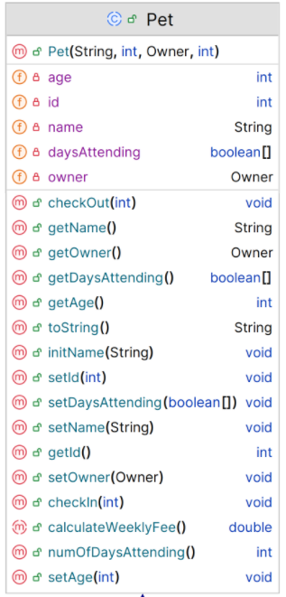

# Pet class

The responsibility for this *abstract* class is to be the super class for the projects. The UML is here:

NOTES: 

- You may add additional instance fields of your choice (for extra credit!).  If you do so, the method list and parameters for existing methods will change/grow.  
- The **Hierarchy Overview** tab has generic information on coding constructors, getters, setters and toString.  The information below is just the specifics related to this class.

---

## Fields

There are five private field in this class:

|      Property                |         Sample Value          |        Default Value   |        Description  |
|------------------------------|------------------------|------------------------|------------------------|
| id                           | >= 1000                | 1000                    |can be generated or passed through constructor |
| name                         | Buddy                | truncates to 30 chars   | max 30 chars   |
| owner                        | Owner object           |         null              |must be a valid owner |
| daysAttending (array)               | true, true, false, false,false, false                  |false, false, false, false, false, false, false        |  boolean for each day attending - true indicates attendance|

The following is a static private field in the Pet class (this has not been shown on the diagram as you can decide to generate the id or pass the id to the pet object when it is being created):

|      Property                |         Sample Value          |        Default Value   |        Description  |
|------------------------------|------------------------|------------------------|------------------------|
| nextId                           | 1000               | 1000                    |

This field is used to create the id, it is incremented by 1 everytime a new Pet is created |

## Constructor

There is one constructor for this class.  id does not need to be passed to the constructor, if it is generated each time a new pet is created.  Pass id as a parameter if not using generation.

## Other methods

`checkIn` - returns nothing. A number indicating the day of the week is passed to the method. 
~~~
        // if valid dayIndex >=0 <= 5 
        //  assign that element of the array to true
~~~

`checkOut` - returns nothing. A number indicating the day of the week is passed to the method. 
~~~
        // if valid dayIndex >=0 <= 5 
        //  assign that element of the array to false
~~~

`numOfDaysInKennel` - returns int. 
~~~
        // iterates through array
        //  Adds 1 to a variable if the element of the array is true
        // returns variable
~~~

## Abstract methods

We know we need these for any pet, but we don't have enough information yet (until we have concrete classes that inherit from this class) to implement them.

- ***calculateWeeklyFee()***

    This method returns the weekly fee for that pet.
   

