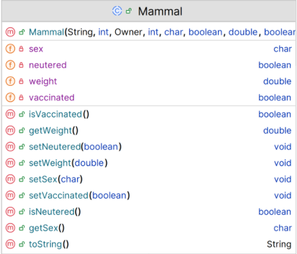

# Mammal class

The responsibility for this *abstract* class is to extend Pet and implement the class for a Mammal.  The UML is here:

NOTES: 

- You may add additional instance fields of your choice (for extra credit!).  If you do so, the method list and parameters for existing methods will change/grow.  
- The **Hierarchy Overview** tab has generic information on coding constructors, getters, setters and toString.  The information below is just the specifics related to this class.

---

## Fields

There are 4 extra private fields in this class:

|      Property                |         Sample Value          |        Default Value   |        Description  |
|------------------------------|------------------------|------------------------|------------------------|
| sex          | M             | M                | M for Male, F for Female, U for Unknown/Not identified|
| vaccinated          | true             | false             |  true if vacinnated|
| neutered          | true            | false                 | true if animal is neutered|
| weight          | 56           | 2                 | weight between 2 and 200 kg|

## Constructor

There is one constructor for this class. The parameter list for this constructor should be the same as the parameter list for the Pet class but with the additional field above .  The constructor should call the superclass constructor and also instantiate the field.

~~~

 public Mammal(String name, int age, Owner owner, int id, char sex, boolean vaccinated, double weight, boolean neutered) {
   
   
~~~

## toString method

This method should build a one line string containing the following information and return it (note: no \n should be included in the String):

- details from the Pet toString() as well as fields above.

