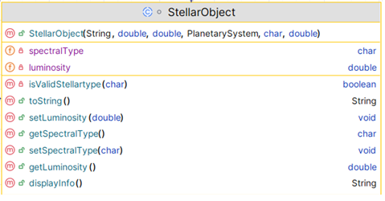

# 6. StellarObject class

A stellar object, is a naturally occurring physical entity, association, or structure that exists within the observable universe, including stars, nebulae, asteroids, and comets

The responsibility for this *abstract* class is to extend CelestialBody by adding two fields. The UML is here:

NOTES: 

- You may add additional instance fields of your choice (for extra credit!).  If you do so, the method list and parameters for existing methods will change/grow.  
- The **Hierarchy Overview** tab has generic information on coding constructors, getters, setters and toString.  The information below is just the specifics related to this class.

---

## Fields

There are two private field in this class:

|      Property                |         Value          |        Default Value   |        Description  |
|------------------------------|------------------------|------------------------|------------------------|
| spectralType                           | O              | M                    |must be one of OBAFGKM  default to M|
| luminosity                         | 1500                | 1000   |must be a value between 1000 and 200000 default to 1000.0  |

## Constructor

There is one constructor for this class.  The parameter list for this constructor should be the the parameter list for the CelestialBody with the additional two fields above.  The constructor should call the superclass constructor.

## methods

- `isValidStellartype(char)` - this method should use the SpectralTypeUtility class to validate the type

- `displayInfo` - this method returns a String 
~~~
        // return the String with the field information
       e.g. Spectral Type: M - Luminosity: 1500;
        
~~~

## JUnit Test Class

This test class will be given to you. 
