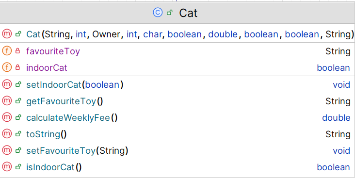

# Cat class

The responsibility for this *concrete* class is to extend Pet and implement the class for a Cat.  The UML is here:

NOTES: 

- You may add additional instance fields of your choice (for extra credit!).  If you do so, the method list and parameters for existing methods will change/grow.  
- The **Hierarchy Overview** tab has generic information on coding constructors, getters, setters and toString.  The information below is just the specifics related to this class.

---

## Fields

There are 2 extra private fields in this class:
  private boolean indoorCat;
  private String favouriteToy;

|      Property                |         Sample Value          |        Default Value   |        Description  |
|------------------------------|------------------------|------------------------|------------------------|
| indoorCat          | false              | true                   | true if cat is indoor only cat|
| favouriteToy          | FEATHER WAND              | not known                   | can use CatToyUtility class - see details |

## Constructor

There is one constructor for this class. The parameter list for this constructor should be the same as the parameter list for the Mammal class but with the additional fields above .  The constructor should call the superclass constructor and also instantiate the field.

~~~
public Cat(String name, int age, Owner owner, int id, char sex, boolean vaccinated, double weight, boolean neutered, boolean indoorCat, String favouriteToy) {
             
      
~~~

## Abstract method

`calculateWeeklyFee` - this method returns a double 
~~~
        // base rate is 20 per day, 
        //an extra 5 is added if the cat is an indoor cat
~~~

## toString method

This method should build a one line string containing the following information and return it (note: no \n should be included in the String):

- details from the Mammal toString() as well as the fields of this class

