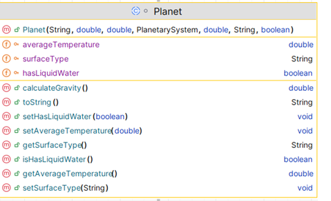

# 8. Planet class

The responsibility for this *abstract* class is to extend CelestialBody by adding three fields. The UML is here:

NOTES: 

- You may add additional instance fields of your choice (for extra credit!).  If you do so, the method list and parameters for existing methods will change/grow.  
- The **Hierarchy Overview** tab has generic information on coding constructors, getters, setters and toString.  The information below is just the specifics related to this class.

---

## Fields
There are three private field in this class:

|      Property                |         Value          |        Default Value   |        Description  |
|------------------------------|------------------------|------------------------|------------------------|
| surfaceType                           | Rocky              | (20 chars)                   |e.g., "rocky", "volcanic", "metallic"  max 20 chars|
| averageTemperature                         | 150                | 0   |Average surface temperature in °C must be a value between -400 and 400 default 0 |
| hasLiquidWater                         | true                | false   |true or false |

## Constructor

There is one constructor for this class.  The parameter list for this constructor should be the the parameter list for the CelestialBody with the additional three fields above .  The constructor should call the superclass constructor.

~~~
    public Planet(String name, double mass, double diameter, PlanetarySystem planetarySystem, double averageTemperature, String surfaceType, boolean hasLiquidWater) 
    
~~~

## Abstract methods

`calculateGravity` - this method returns a (double) value for the gravity.  The algorithm for calculating this is: 
~~~
        // Algorithm - 
        //  (mass multipled by 6.67430e-11) divided by (half the diameter to the power of 2)
~~~

## JUnit Test Class

The Test Class for **Planet** (PlanetTest.java) is not included in the starter code and needs to be written. Because Planet is an abstract class, the test Class will need to create a concrete subclass (use StellarObject as an example)

