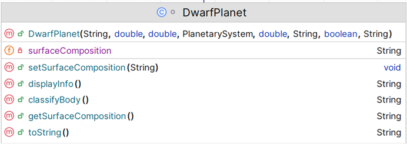

# 9. DwarfPlanet class

The responsibility for this *concrete* class is to extend Planet. The UML is here:

NOTES: 
 
- You may add additional instance fields of your choice (for extra credit!).  If you do so, the method list and parameters for existing methods will change/grow.  
- The **Hierarchy Overview** tab has generic information on coding constructors, getters, setters and toString.  The information below is just the specifics related to this class.

---

## Fields

There is one  private field in this class:

|      Property                |         Value          |        Default Value   |        Description  |
|------------------------------|------------------------|------------------------|------------------------|
| surfaceComposition          | rocky with frozen nitrogen              | (100 chars)                   |e.g., "rocky and frozen", "volcanic and hilly", "metallic with craters"  max 100 chars|

## Constructor

There is one constructor for this class. The parameter list for this constructor should be the same as the parameter list for the PLanet class but with the additional field above .  The constructor should call the superclass constructor and also instantiate the field.

~~~
  public DwarfPlanet(String name, double mass, double diameter, PlanetarySystem planetarySystem, double averageTemperature, String surfaceType, boolean hasLiquidWater, String surfaceComposition) 
   
~~~

## Abstract method

`displayInfo` - this method returns a String 
~~~
        // return the String with the field information
        e.g return
        Surface Composition: rocky with frozen nitrogen
        
~~~
`classifyBody` - this method returns a String 
~~~
        // return the String with the the text "Dwarf Planet" in it
        
~~~

## JUnit Test Class

No need to write Test Case