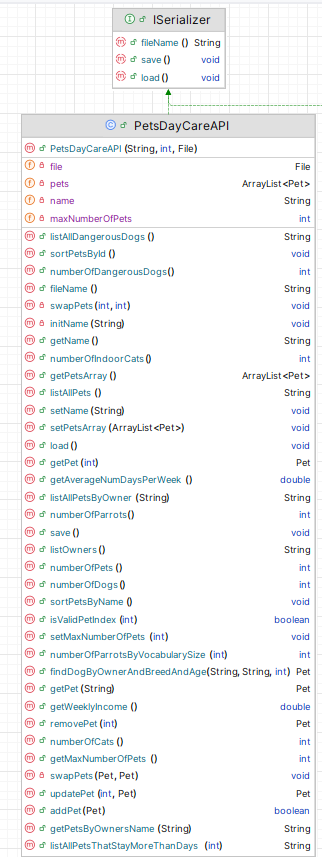

# PetsDayCareAPI class 
TODO CHECK ALL METHODS HERE

This API class is responsible for storing and managing ALL the Pets in the system. 

This UML here is starter UML - depending on the menu items you include in your Driver class, the methods here will grow / change:

There is starter code for DayCareAPI in the Starter Code you are given.

---

## Fields

There are four private fields, 
 - *pets*, which is an ArrayList of *Pet*;
 - *maxNumberOfPets* , the max number of pets the kennels has space for, can change over time
 - *name* , kennel name max 20 chars
 - *file* , name of file to save pets to/load pets from

---

## Basic CRUD on Pets ArrayList

### addPet (with the new Pet as a parameter)
This method will add a Pet object (passed as a parameter) to the ArrayList *pets*.  There is no validation in this method.  Returns true if the Pet was added and false if not.

### deletePetByIndex (with index - position of Pet in array list as parameter)
  This method removes an Pet object at the location *index*, which is passed as a parameter.  There is some validation in this method.  
  - Check that the passed index exists in the ArrayList:
      - if it does exist, remove it from the ArrayList and return *the object that was just deleted*.
      - if the passed index is not valid, return *null*.

### deletePetById (with id of Pet as parameter)
  This method removes an Pet object with the id which is passed as a parameter.  There is some validation in this method.  
  - Check that the passed id exists in the ArrayList:
      - if it does exist, remove the corresponding Pet from the ArrayList and return *the object that was just deleted*.
      - if the passed index is not valid, return *null*.

### getPet(with index - position of Pet in array list as parameter)
 This method returns an Pet object at the location *index*, which is passed as a parameter.  There is some validation in this method.  
  - Check that the passed index exists in the ArrayList:
      - if it does exist, return *the object at that position*.
      - if the passed index is not valid, return *null*.

### getPet(with name of Pet as parameter)
 This method returns an Pet object , which is passed as awith this name.  
      - if it does exist, return *the first object with that name*.
      - if the passed index is not valid, return *null*.

### getPetById(with id of Pet as parameter)
 This method returns a Pet object with that exact *id* (ignoring case), which is passed as a parameter.  There is some validation in this method.  
  - Check that the passed *id* exists in the ArrayList:
      - if it does exist, return *the object with that id*.
      - if the passed id is not found, return *null*.

---

## Reporting Methods

### listAllPets()
This method should return a String containing the details of all the pets in **pets** along with the index number associated with each Pet object.  If no pets exist yet, **"No Pets"** should be returned.

### listAllCats()
This method should return a String containing the details of all the cats in **pets** along with the index number associated with each Cat object.  If no cats exist yet, **"No cats"** should be returned.

### listAllDogs()
This method should return a String containing the details of all the dogs in **pets** along with the index number associated with each Dog object.  If no dogs exist yet, **"No Dogs"** should be returned.

### listAllParrots()
This method should return a String containing the details of all the dogs in **pets** along with the index number associated with each Dog object.  If no dogs exist yet, **"No Parrots"** should be returned.

### listAllDangerousDogs()
This method should return a String containing the details of all the dangerous dogs in **pets** along with the index number associated with each Dog object.  If no dogs exist yet, **"No Dogs"** should be returned.
 
- If no dangerous dogs exist, **"No Dangerous Dogs in the Kennels"** should be returned.

### listAllPetsByOwner(String owner as a parameter)
This method should return the list of pets associated with that owner.
 

- If no such Pet exist, **"No Pet with owner ??"** (include owner name) should be returned..

### listAllPetsThatStayMoreThanDays(numDays as a parameter)
This method should return the list of pets with that stay more than the input days.
 

- If no such Pet exist, **"No Pet stays longer than ??"** (include num days) should be returned..

### numberOfPets()
This method returns the number of Pet objects in the system (in **pets**).

### numberOfCats()
This method returns the number of Cat objects  in the system (in **pets**).

### numberOfDogs()
This method returns the number of Dog objects in the system (in **pets**).

### numberOfParrots()
This method returns the number of Dog objects in the system (in **pets**).

### numberOfDangerousDogs()
This method returns the number of dangerous Dogs in the system (in **pets**).

### numberOfIndoorCats()
This method returns the number of indoor cats in the system (in **pets**).

### numberOfParrotsByVocabularySize(vocabSize as parameter)
This method returns the number of parrots in the same category of words as the number entered (in **pets**).
---

## Update Methods

### updatePet (with the update Pet as a parameter and with index - position of Pet in array list as paramete)
This method will update an existing Pet object (index passed as a parameter) to the ArrayList *pets*.   Returns null if the Pet was not update and object if was.

## Validation Methods

### isValidPetIndex(with index - position of Pet in array list as parameter)
 This method returns a boolean at the if this is a valid index. There is some validation in this method.  
  - Check that the passed index exists in the ArrayList:
      - if it does exist, return *true*.
      - if the passed index is not valid, return *false*.

---

## Other Methods
### getWeeklyIncome()
 - returns a weekly income from all pets in the kennels
 - 
### getAverageNumDaysPerWeek()
 - returns a average number of days that pets stay in the kennels
 
### findDogByOwnerAndBreedAndAge(String name, String breed, int age)
 - returns the pet that matches the parameters passed in, 
 - returns null if there is no match

### getPetsByOwnersName(String name)
 - returns a String with all the pets for a particular owner name
 - returns **"No Pets for ??"** if there are no pets for that owner
  
---

## Sorting Methods

**Note** No marks will be given if you use library sort methods, i.e. you need to adapt the sort code given in class so that it applies to the particular data structure and the particular sort. 

### sortPetsById()
This method should change the pets object so that it is sorted by id in descending order. 

### sortPetsByName()
This method should change the pets object so that it is sorted by pet name in ascending order.

### swapPets (int i, int j)
This should be a private method that swaps the objects at positions i and j in the collection **pets**. This method should be used in your sorting method. 

### swapPets (Pet i, Pet j)
This should be a private method that swaps the objects i and j in the collection **pets**. This method should be used in your sorting method. 

## Other Methods
### findDogByOwnerAndBreedAndAge()
 - returns a Pet object that matches the owner name, breed and age
 

---
## Persistence

### save
This method saves all Pet objects from the ArrayList  to an XML file *Pets.xml*.  

### load
This method loads all saved Pet objects back into the program (i.e into the ArrayList pets) from the XML file *Pets.xml*.  

---

