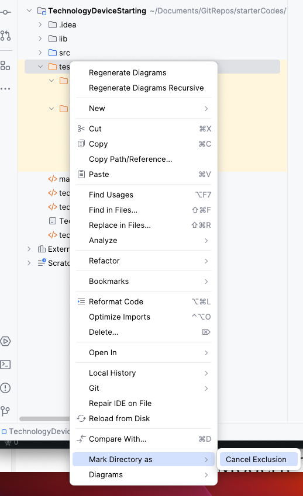
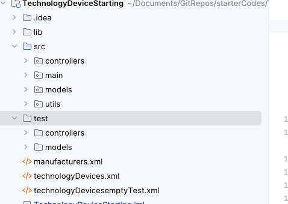
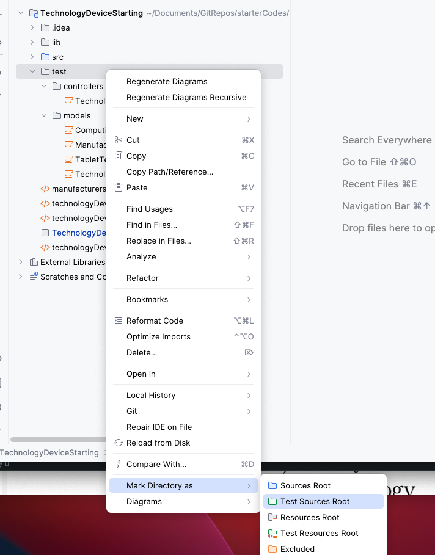
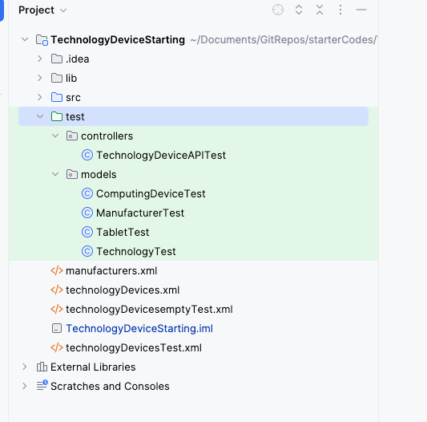
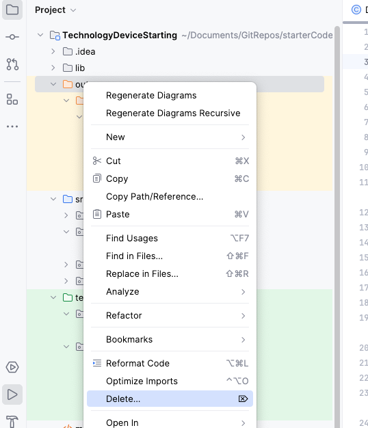
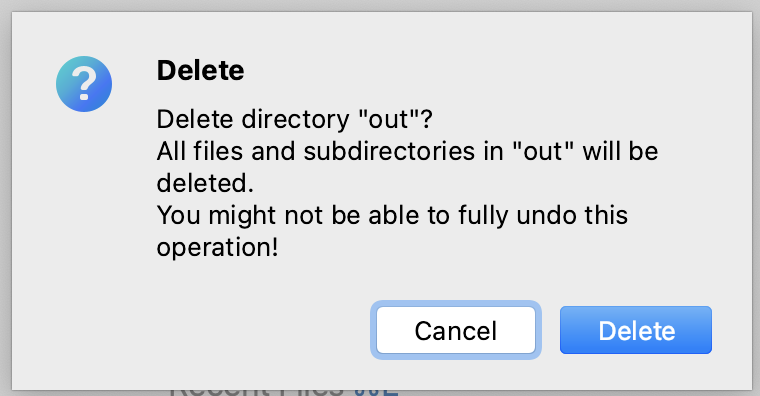
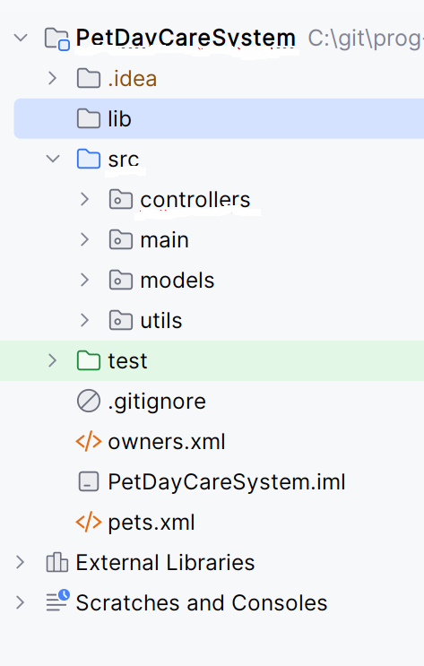

## JUnit

- **OwnerTest** - The OwnerTest  class is included as an example (in Starter Code)
- **PetTest** - The Pet (abstract) class is fully tested (in Starter Code)
- **MammalTest** - The Mammal (abstract) class is fully tested (in Starter Code)
- **BirdTest** - The Bird (abstract) class  is fully tested (in Starter Code)
- **DogTest** - The Dog class is fully tested (in Starter Code)
- **OwnerAPITest** - this is fully tested (in Starter Code)
- **PetsDayCareAPITest** - this is partially tested, ***you need to complete this to 90-100%***.  (partal tests in Starter Code)

## What you need to develop from scratch:

- **CatTest** - model this on the Mammal code above.  Aim for 90-100% coverage.
- **ParrotTest** - model this on the DogTest code above.  Aim for 90-100% coverage

- **PetsDayCareAPITest** - achieve a code coverage of at least 90% (starter test code provided above).  Note: code coverage percentage is based on all the functionality completed.

## How to write them

See next tab for further information

# Running the Tests 

### Test Folder is Excluded

- The test folder is coloured orange in your skeleton code (it will look more orange in your project).  This means that it is excluded and cannot be "seen" by the compiler or the JUnit test runners.

### Including the Test Folder

- To run your tests, you need to include the test folder by following these steps:

1. Right click on the orange test folder and "cancel exclusion":

2. Your test folder will now be grey:

3.  Right click on the grey test folder and "Mark Directory As", "Test Sources":

4. The test folder will now be green and you can now run your tests as normal:

### Delete the out folder

The orange "out" folder is generated by the compiler.  

You can delete this by right clicking on it and selecting "delete":

Confirm that you want to delete the folder (it will be regenerated when you compile again)

### Folder Structure

Your folder structure should now look like this:

