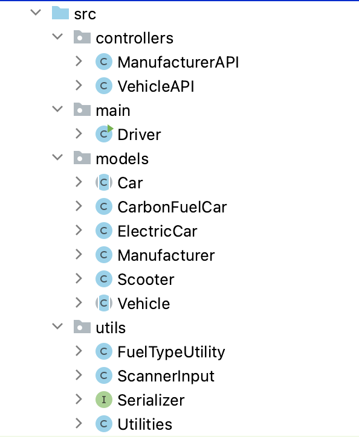
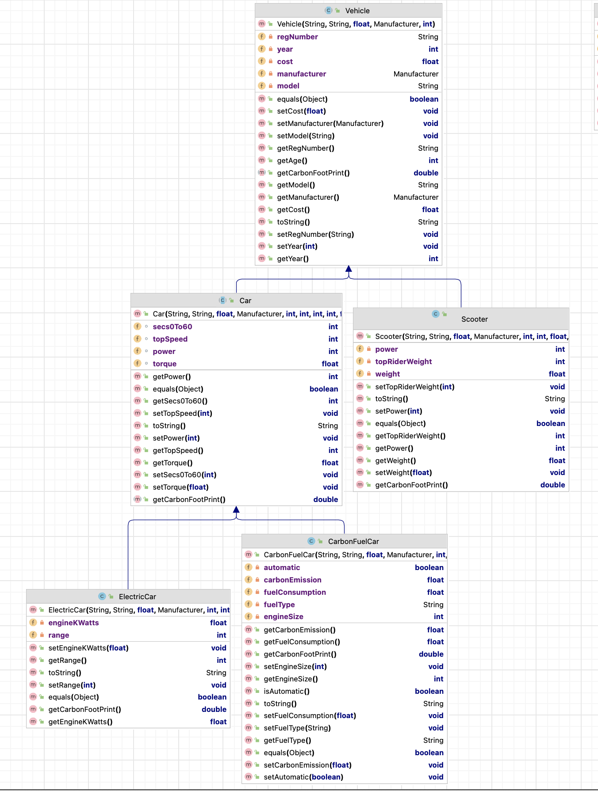

#2. Classes Overview

The System has the follwing *src* classes:

## Starting the  New Project

Accept the Starter code (as in the previous assignment) from here, XXXXXX. You will see the starting code. Note that it is not complete, not all the classes etc. are included. You will need to add these yourself.

When you have the code added:

- run the Driver menu and familiarise yourself with the menu.
- familliarise yourself with the code given to you.
- familiarise yourself with the TODO comments in the code.  All the information required to complete the TODO comments are in this spec.  You should read through the spec now, so that you have a good handle on what you need to do. 

---

## Classes that are completed:
(all available in Starter Code) 
| Class Name   | Responsibility                                               |
| :----------- | :----------------------------------------------------------- |
| Manufacturer| The responsibility for this class is to store a Manufacturer i.e. a manufacturer  has a name and a number of employees.  |
| ManufacturerAPI | The responsibility for this class is to store and manage a list of Manufacturers.  Vehicles can only be added for Manufacturers that exist in this list. |
| ScannerInput| This is the same class from Assignment 1 and should be used for all user input. |
| Utilities  | This class contains utility methods used throughout the system in multiple classes.  |
| FuelTypeUtility | This class contains utility methods used to validate fuel types (petrol/diesel)  |

---

## Classes that are partially completed:

| Class Name   | Responsibility                                               |
| :----------- | :----------------------------------------------------------- |
| Driver | The responsibility for this class is to manage the User Interface (UI) i.e. the menu and user input/output.  This class should be the only class that has System.out.println() or Scanner reads in it.  This class contains an object of VehicleAPI and an object of ManufacturerAPI. |
| VehicleAPI | The responsibility for this class is to store and manage a list of Vehicle.  Note that Vehicle is the super class in the hierarchy pictured below, so any subclass objects can be added to this list of Vehicles e.g. an object of Scooter can be added to it. |

---

## An Interface that you need to include is:

| Interface Name | Responsibility                                               |
| :------------- | :----------------------------------------------------------- |
| ISerializer   | This interface is the same as that used in lectures and labs.  It should be implemented by both the VehicleAPI and ManufacturerAPI for XML persistence in these classes.  |

---

## Classes that you need to write from scratch (i.e. the Inheritance Hierarchy):

| Class Name  | Type          | Abstract or Concrete |  Responsibility                       |   
| :---------- | :------------ | :-------------------- | :----------------------------------- |
|Vehicle   |      Super Class | Abstract      | Manages the common information relating to an Vehicle i.e. reg number, year, cost, manufacturer and model |
| Car | Sub Class of Vehicle |  Abstract | Manages the  information relating to a Car i.e. secs0to60, topSpeed, power, torque |
| ElectricCar  | Sub Class of Car |  Concrete | Manages the specific information relating to an ElectricCar i.e. engineKWatts  |
| CarbonFuelCar  |Sub Class of Car | Concrete | Manages the specific information relating to a CarbonFuelCar e.g. automatic (y/n), carbonEmission, fuel consumption etc. |
| Scooter  |Sub Class of Vehicle|  Concrete | Manages the specific information relating to a Scooter i.e.power, topRiderWeight and weight.|

---
