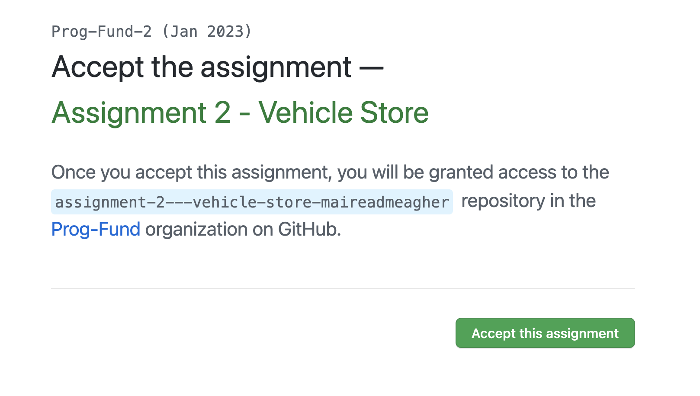
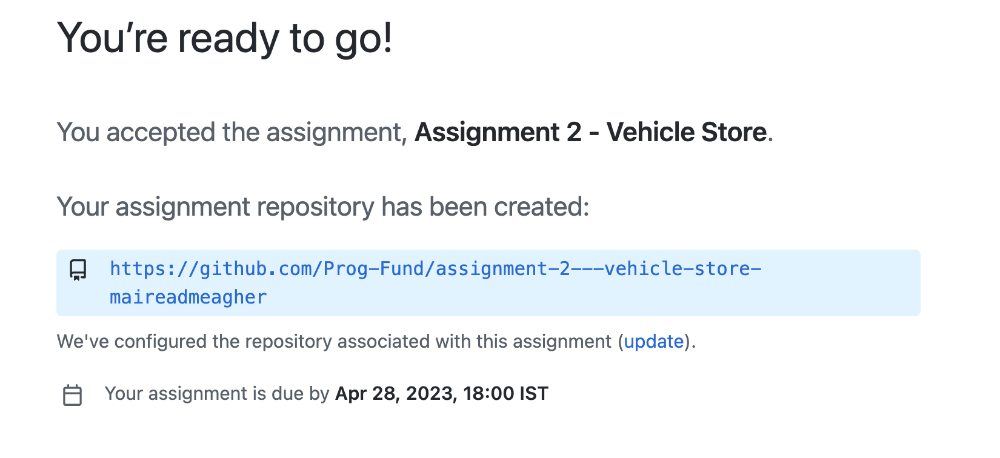
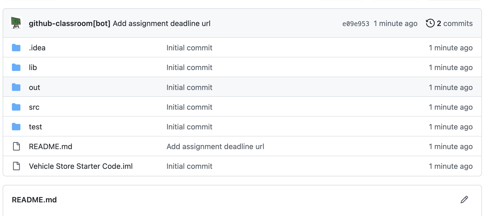
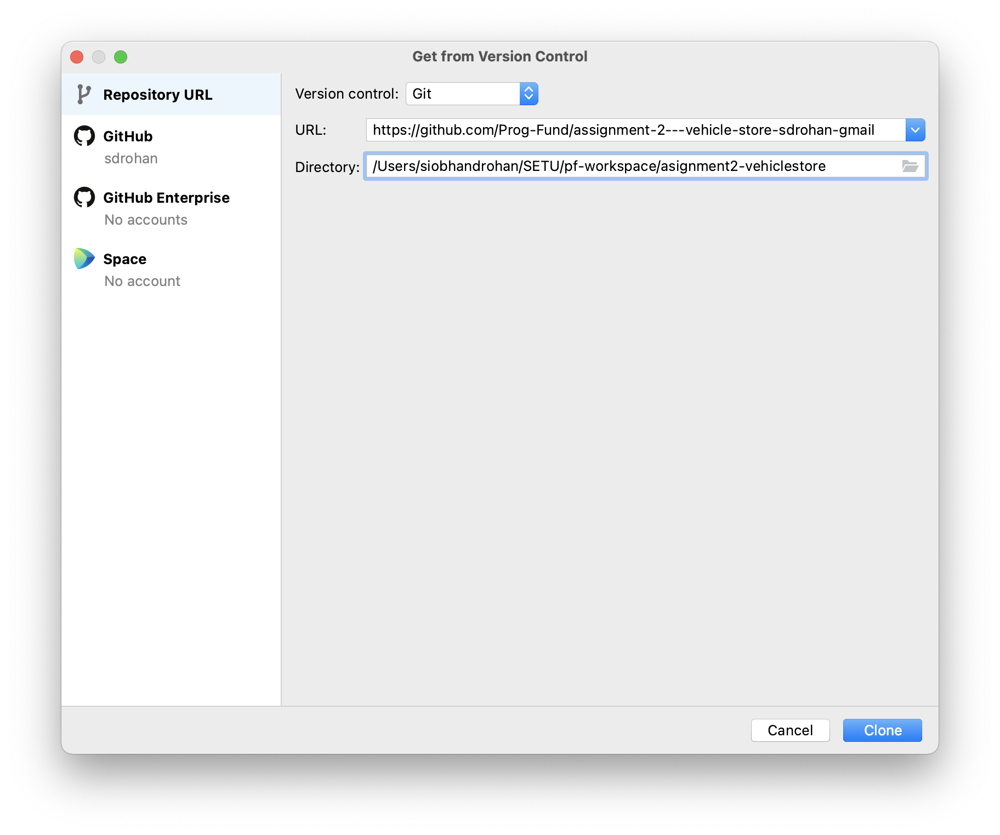
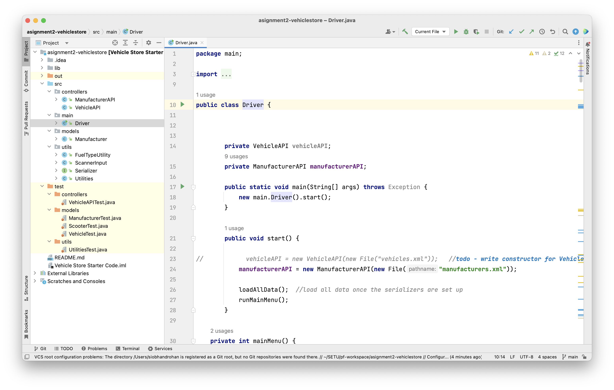

#3. Accepting the Assignment

**This is the same process as you used in the Formative Assignment and Assignment 1**

Accept Assignment  by clicking on this invite link:

<https://classroom.github.com/a/WChCizqR>

You will be prompted to accept the assignment:

 

Github will create a remote repository for you (refresh the page to see it):

 

Open your repository to see the starter project:

 

Copy the URL for your remote repo...you will need it in the next step.

#2. Clone via IntelliJ

Launch IntelliJ and click **Get from VCS**.

With **Repositorty URL** highlighted on the left hand side, paste the link to your remote repository into the **URL** box:

 

Then choose a location on your computer for the local copy of the code to reside (OneDrive if you are using college computers).  

Click the **Clone** button.

## Authenticate yourself

You may be asked to authenticate your GitHub account.  If you are, follow these steps below. 

 

If the "Login via GitHub" results in a failed clone, then you will need to restart the clone above and this time, choose the "Use Token" option. 

 

When you click on the "Generate..." button, you will be brought to your browser, where you can select "90 days" or more as your Expiration date.  Then scroll down and click the "Generate Token" button.

Copy the token, return to IntelliJ and paste it into the Token field.  Then click Log In.  

## Cloning will start...

Your project should start cloning successfully now. When you are aksed if you trust the project...you do.

A local copy of the remote project should now open in IntelliJ.  It should look like this:

**Make sure that your project looks the same as our screen shot above before continuing.**

