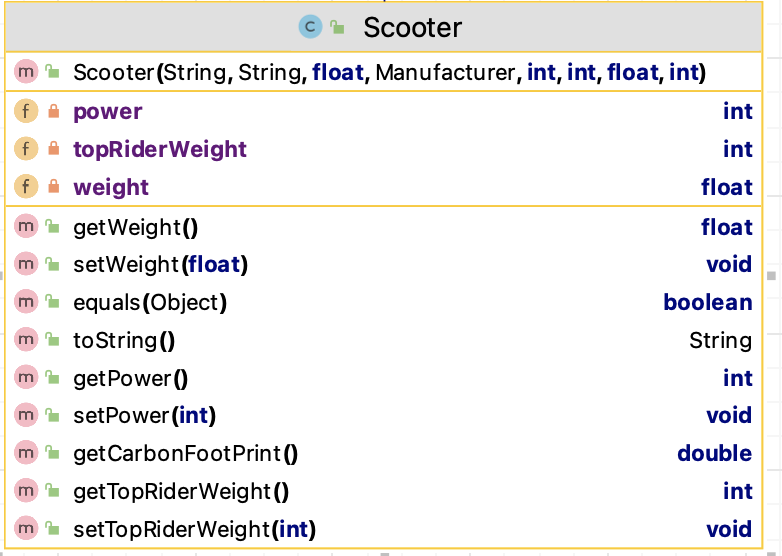

#6. Scooter class

The responsibility for this *concrete* class is to extend Vehicle and implement the class for an Scooter.  The UML is here:

NOTES: 

- You may add additional instance fields of your choice (for extra credit!).  If you do so, the method list and parameters for existing methods will change/grow.  
- The **Hierarchy Overview** tab has generic information on coding constructors, getters, setters and toString.  The information below is just the specifics related to this class.

---

## Fields

There are  private field in this class:

- *power* : This is the power of the scooter. It should be between 250 -> 1000 inclusive, default is 250.
- *weight* : This is the weight of the scooter (in kg). It should be between 5 -> 100 inclusive, default is 5.
*topRiderWeight* : This is the max weight of the scooter's rider. It should be between 100-> 120 inclusive, default is 100.

## Constructor

There is one constructor for this class.  The parameter list for this constructor should be the same as the parameter list for the Vehicle class but with the additional 3 fields (above).  The constructor should call the superclass constructor and also instantiate the new three fields (with validations).

## Abstract method

`getCarbonFootPrint` - this method returns a (double) value for the carbon footprint of a Scooter.  The algorithm for calculating the footprint is: 
~~~
        // Algorithm - carbon footprint of a Scooter is 
        //  ( power (of scooter) * weight (of scooter) * age (of scooter) ) / load factor for Scooter of 15000  
        //  e.g.  (250 * 45 * 2) / 15000 = 1.5
~~~

## toString method

This method should build a one line string containing the following information and return it (note: no \n should be included in the String):

- details from the Vehicle toString() as well as 
- power
- weight
- topRiderWeight
- carbon footprint

## JUnit Test Class

The Test Class for Scooter(ScooterTest.java) is given is included in the starter code and fully written. Note that you need to have Vehicle written to run this test class. 
