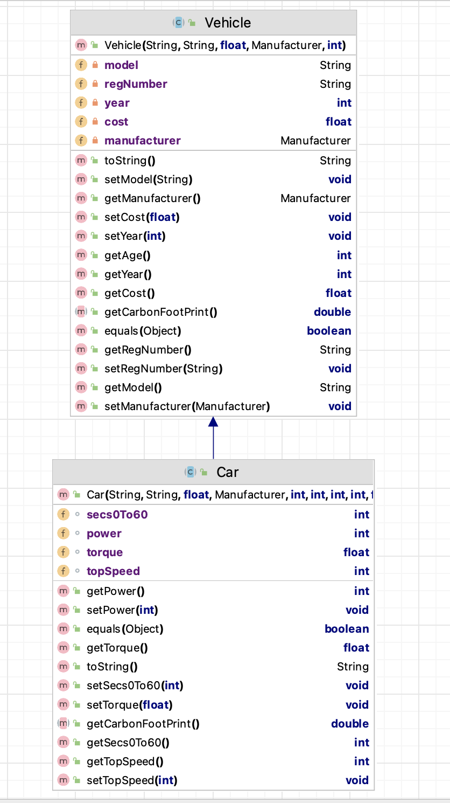

#7. Car class

The responsibility for this *abstract* class is to extend Vehicle by adding four fields. The UML is here:

NOTES: 

- You may add additional instance fields of your choice (for extra credit!).  If you do so, the method list and parameters for existing methods will change/grow.  
- The **Hierarchy Overview** tab has generic information on coding constructors, getters, setters and toString.  The information below is just the specifics related to this class.

---

## Fields

There are four private field in this class:

- *power* : This is the power of the car. It should be between 120 -> 300 inclusive, default is 120.
- *secs0To60* : This is time (in secs) needed for the car to increase its speed from 0 to 60. It should be between 4 -> 25 inclusive, default is 4.
*topSpeed* : This is the max speped of the car (k/h). It should be between 50-> 3000 inclusive, default is 50.
*torque* : This is the torque of the car. It should be between 100-> 400 inclusive, default is 100.

## Constructor

There is one constructor for this class.  The parameter list for this constructor should be the the parameter list for the Vehicle with the additional four fields above .  The constructor should call the superclass constructor.

## Abstract method

`getCarbonFootPrint` - this can be left as abstract in this class

## JUnit Test Class

You are asked to write the Test Class for Car. You should use the test class for Scooter as inspiration. 
