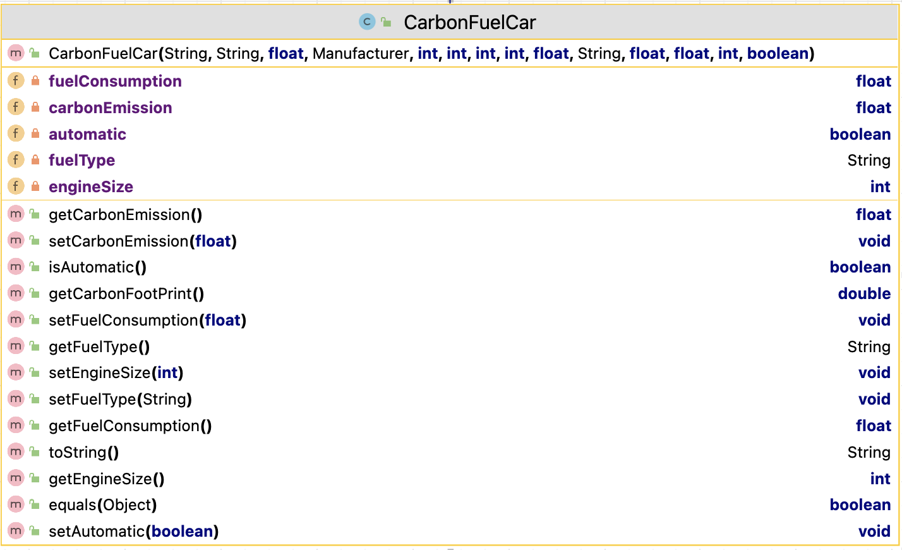

#8. CarbonFuelCar class

The responsibility for this *concrete* class is to extend Car (which has extended Vehicle) and implement the class for an CarbonFuelCar.  The UML is here:

NOTES: 
 
- You may add additional instance fields of your choice (for extra credit!).  If you do so, the method list and parameters for existing methods will change/grow.  
- The **Hierarchy Overview** tab has generic information on coding constructors, getters, setters and toString.  The information below is just the specifics related to this class.

---

## Fields

There are five  private field in this class:

- *fuelConsumption* : This is the carbonFuelCar's fuel consumption in litres per 100k. It should be between 5 -> 20 inclusive, default is 5.
  

- *carbonEmission* : This is a measure of the carbon emission for this carbonfuel car It should be >0,   default is 1.

- *engineSize* : This is the carbonFuelCar's engine size in cc. It should be between 800->2500 inclusive, default is 800.

- *automatic* : This is a boolean where true indicates that the car is automatic, false indicates that the car is manual. It defauls to false (manual)

- *fuelType* : This string indicates whether the fuel type is "diesel" or "petrol". The default value is "petrol".
  
  **Hint**: See the FuelTypeUtility for ways to validate this value. 

## Constructor

There is one constructor for this class. The parameter list for this constructor should be the same as the parameter list for the Car class but with the additional five fields above .  The constructor should call the superclass constructor and also instantiate all fields.

## Abstract method

`getCarbonFootPrint` - this method returns a (double) value for the carbon footprint of a CarbonFuelCar.  The algorithm for calculating the footprint is: 
~~~
        // Algorithm - carbon footprint of a CarbonFuelCar is 
        //   (engine size * fuel consumption * carbon emission * age of car) / load factor for carbon fueled car of 2000
        //  e.g. (1200 * 6 * 5 * 6) / 2000 = 43.2
~~~

## JUnit Test Class

You are asked to write the Test Class for CarbonFuelCar. You should use the test class for Scooter as imspiration. 
