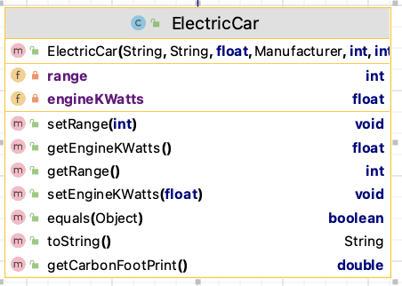

#9. ElectricCar class

The responsibility for this *concrete* class is to extend Car (which has extended Vehicle) and implement the class for an ElectricCar.  The UML is here:

NOTES: 
 
- You may add additional instance fields of your choice (for extra credit!).  If you do so, the method list and parameters for existing methods will change/grow.  
- The **Hierarchy Overview** tab has generic information on coding constructors, getters, setters and toString.  The information below is just the specifics related to this class.

---

## Fields

There are two  private field in this class:

- *engineKWatts* : This is the electricCar's engine power (KWatts). It should be between 40 -> 60 inclusive, default is 40.

- *range* : This is a measure of how far the electricCar can travel (in kms) from full charge.  It should be between 100 -> 500 inclusive, default is 100.

## Constructor

There is one constructor for this class. The parameter list for this constructor should be the same as the parameter list for the Car class but with the additional five fields above .  The constructor should call the superclass constructor and also instantiate all fields.

## Abstract method

`getCarbonFootPrint` - this method returns a (double) value for the carbon footprint of an ElectricCar.  The algorithm for calculating the footprint is: 
~~~
        // Algorithm - carbon footprint of an ElectricCar is 
        //   (engine kw * age of car) / load factor for electric car of 20000 
        //   e.g. (40000 * 6) / 20000 = 12
~~~

## JUnit Test Class

You are asked to write the Test Class for ElectricCar. You should use the test class for Scooter as imspiration. 
