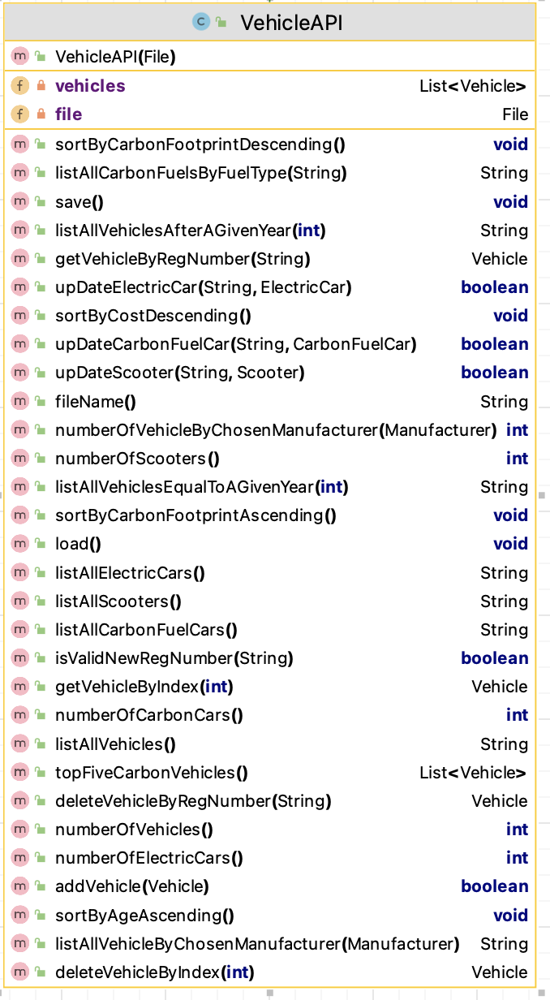

#10. VehicleAPI class 

This API class is responsible for storing and managing ALL the Vehicles in the system. 

This UML here is starter UML - depending on the menu items you include in your Driver class, the methods here will grow / change:

There is starter code for VehicleAPI in the Starter Code you are given.

---

## Fields

There are two private fields, 
 - *vehicles*, which is an ArrayList of *Vehicle*;
 - *file* , the file that vehicles will be saved to /loaded from.

---

## Basic CRUD on vehicles ArrayList

### addVehicle (with the new vehicle as a parameter)
This method will add an Vehicle object (passed as a parameter) to the ArrayList *vehicles*.  There is no validation in this method.  Returns true if the vehicle was added and false if not. 

### deleteVehicleByIndex (with index - position of vehicle in array list as parameter)
  This method removes an vehicle object at the location *index*, which is passed as a parameter.  There is some validation in this method.  
  - Check that the passed index exists in the ArrayList:
      - if it does exist, remove it from the ArrayList and return *the object that was just deleted*.
      - if the passed index is not valid, return *null*. 

### deleteVehicleByRegNumber (with reg number of vehicle as parameter)
  This method removes an vehicle object with the reg number which is passed as a parameter.  There is some validation in this method.  
  - Check that the passed reg number exists in the ArrayList:
      - if it does exist, remove the corresponding vehicle  from the ArrayList and return *the object that was just deleted*.
      - if the passed index is not valid, return *null*. 

### getVehicleByIndex (with index - position of vehicle in array list as parameter)
 This method returns an Vehicle object at the location *index*, which is passed as a parameter.  There is some validation in this method.  
  - Check that the passed index exists in the ArrayList:
      - if it does exist, return *the object at that position*.
      - if the passed index is not valid, return *null*. 

### getVehicleByRegNumber (with reg number - reg number of vehicle as parameter)
 This method returns a Vehicle object with that exact *regNumber* (ignoring case), which is passed as a parameter.  There is some validation in this method.  
  - Check that the passed *regNumber* exists in the ArrayList:
      - if it does exist, return *the object with that name*.
      - if the passed name is not found, return *null*. 

---

## Reporting Methods

### listAllVehicles()
This method should return a String containing the details of all the vehicles in **vehicles** along with the index number associated with each vehicle.  If no vehicles exist yet, **"No vehicles"** should be returned.

### listAllScooters()
This method should return a String containing the details of all the Scooter vehicles in **vehicles** along with the index number associated with each vehicle. If no such vehicles exist, **"No scooters."** should be returned.

### listAllElectricCars()
This method should return a String containing the details of all the Electric Cars in **vehicles** along with the index number associated with each vehicle. If no such vehicles exist, **"No Electric Cars"** should be returned.

### listAllCarbonFuelCars()
This method should return a String containing the details of all the Carbon Fuel Cars in **vehicles** along with the index number associated with each vehicle. If no such vehicles exist, **"No Carbon Fuel Cars"** should be returned.

### listAllCarbonFuelsByFuelType(with fuel Type(String) as a parameter)
This method should return the list of vehicles whose fuel type is that entered as parameter.
There is some validation in this method. Check that the String passed in is a valid  fuel type (i.e. "diesel" or "petrol") 
- If the string is invalid  **Invalid fuel type entered** should be returned 
- If no such vehicles exist, **No vehicles for with "fuel type"exists"** exists.

### listAllVehicleByChosenManufacturer( with a Manufacturer as a parameter)
This method should return a String containing the details of all the vehicles in **vehicles** whose manufacturer is equal to that passed in as parameter. 
If no such vehicles exist, **"There are no vehicles  who have  " + manufacturer + " in the list"** should be returned. 

### listAllVehiclesEqualToAGivenYear( with a  year as a parameter)
This should return a String containing all the vehicles that have the same year as the year passed in as a parameter.  If no such vehicles exist, **"No vehicles exist for " + year** should be returned.

### listAllVehiclesAfterAGivenYear(with a  year as a parameter)
This should return a String containing all the vehicles that have year >  the year passed in as a parameter.  If no such vehicles exist, **"No vehicles exist later than " + year** should be returned.

### numberOfVehicles()
This method returns the number of vehicles in the system (in **vehicles**). 

### numberOfScooters()
This method returns the number of scooters in the system (in **vehicles**). 

### numberOfElectricCars()
This method returns the number of electric cars  in the system (in **vehicles**). 

### numberOfCarbonCars()
This method returns the number of  carbon fuel cars in the system (in **vehicles**). 

### numberOfVehicleByChosenManufacturer(with a manufacturer passed in as a parameter)
This method returns the number of  vehicles  in the system (in **vehicles**) whose manufacturer is that passed in. 

---

## Update Methods 

### upDateElectricCar(String regNo, ElectricCar updatedCar)
This method takes in a regNo and replaces the corresponding  object with the ElectricCar as input (updatedCar).

### upDateCarbonFuelCar(String regNo, CarbonFuelCar updatedCar)
This method takes in a regNo and replaces the corresponding  object with the CarbonFuelCar as input (updatedCar).

### upDateScooter(String regNo, Scooter updatedScooter)
This method takes in a regNo and replaces the corresponding  object with the Scooter as input (updatedScooter).

## Validation Methods

### isValidNewRegNumber( with reg number as as parameter)
This method is written for you.  It returns 
  - **true** if that reg number does not exist in the **vehicles** collection
  - **false** if that reg number does  exist in the **vehicles** collection

---

## Sorting Methods

### sortByCostDescending()
This method should change the vehicles object so that it is sorted by cost in descending order. 

### sortByAgeAscending()
This method should change the vehicles object so that it is sorted by age of vehicle in ascending order. 

### sortByCarbonFootprintAscending()
This method should change the vehicles object so that it is sorted by carbin footprint of vehicle in ascending order. 

### swapVehicles (List< Vehicle > vehicles, int i, int j)
This should be a private method that swaps the objects at positions i and j in the collection **vehicles**. This method should be used in your sorting method. 

## Other Methods
### topFiveCarbonVehicles()
 - returns a List of the top 5 carbon fuel vehicles (i.e.those with the lowest carbon footprint)

---

## Persistence

All of the persistence methods are supplied in the starter code.  

**TODO:** make sure you implement the ISerializer interface in VehicleAPI (and also ManufacturerAPI).

### save
This method saves all Vehicle objects from the ArrayList vehicles to an XML file *vehicles.xml*.  

### load
This method loads all saved Vehicle objects back into the program (i.e into the ArrayList vehicles) from the XML file *vehicles.xml*.  

### fileName()
This method should return the file that the vehicles collection is saved to/load from. 

---

## JUnit Test Class

A partial test class for VehicleAPI given in the Starter Code

You are asked to complete the given test class.  

You can check how complete your updated test class is by using the **Coverage** Tool in **Intellij**. 

---
