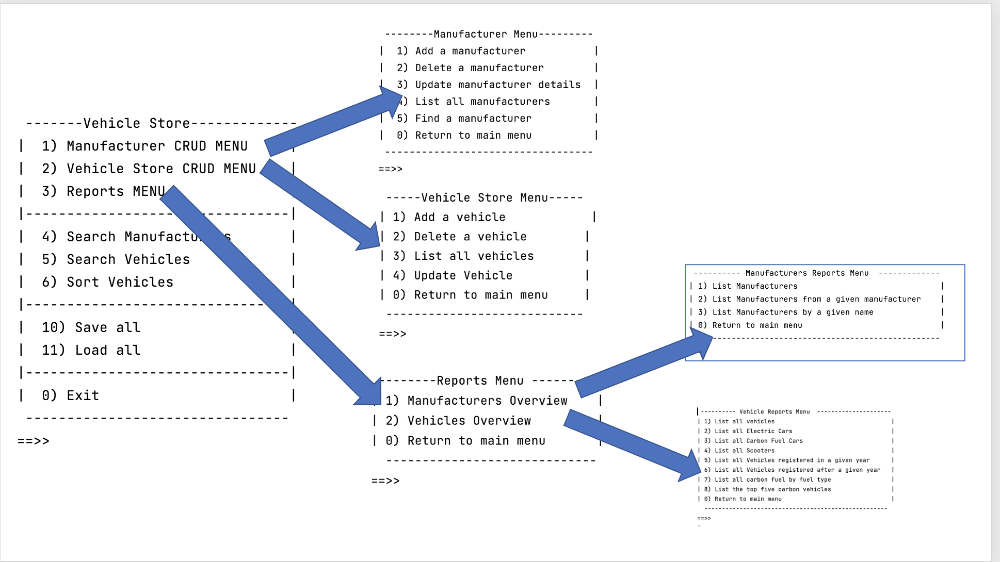

#11. Driver class

The responsibility of the Driver class is to run the app and perform I/O with the user.   

There is starter code for Driver in the Starter Code. 
 
## Menu

The code supplied uses a "layered" menu approach i.e. a suggested main menu that calls suggested sub menus e.g.: 

We have given complete code for the Manufacturer Management Menu, and some skeleton code for the remaining options.  

It is completely up to you how you would like to design the  Vehicle Store Menu and the Reports Menu.  As you design these, you should try use all the methods that are written in VehicleAPI. For example:

- when reporting on the Vehicle Store, you have different types of Vehicles to report on e.g. ElectricCars, etc. 
- when reporting on manufacturers, you can report on all manufacturers or one specifically.

When writing this class, the above menus are just a suggestion.  You may deviate from them as you wish.  If you provide more elaborate menu items/reports, you may need to add more methods to the ManufacturerAPI and/or VehicleAPI class (extra credit!).

If you do deviate from the suggested menus, ensure that you still include the following basic elements:

- CRUD on the vehicles list
- Reporting for both Vehicles and Manufacturers and
- Persistence

## A note on I/O
Aside from the ScannerInput class, this class should be the only class that has:

- System.out.print statements
- ScannerInput objects defined/used. 

