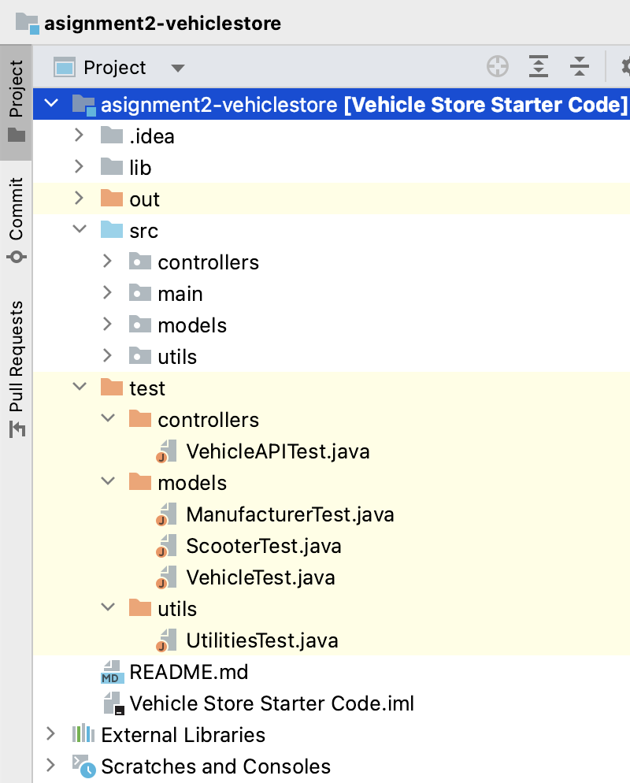
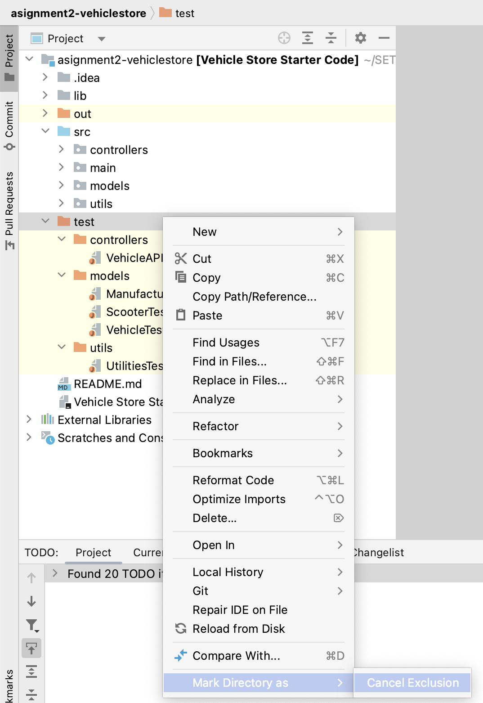
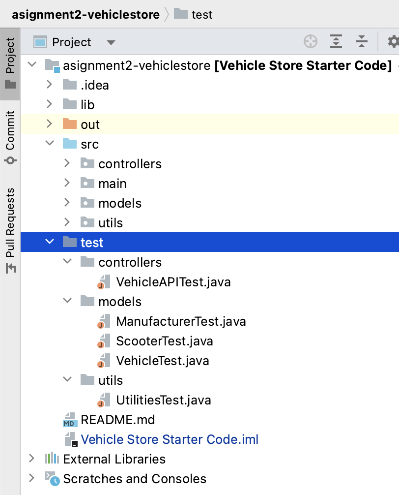
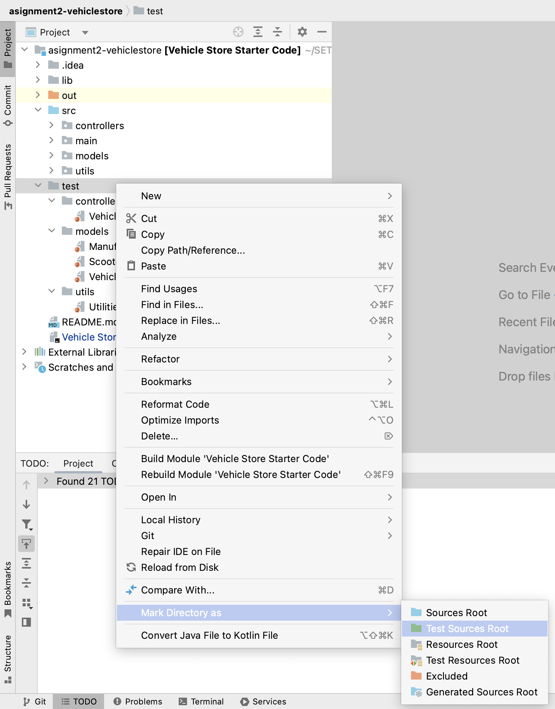
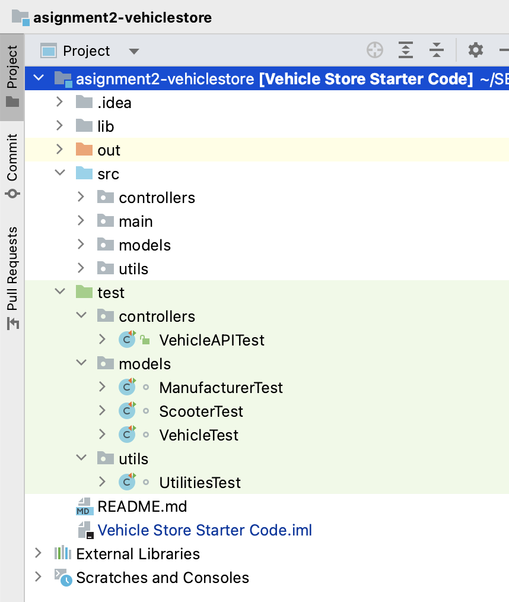
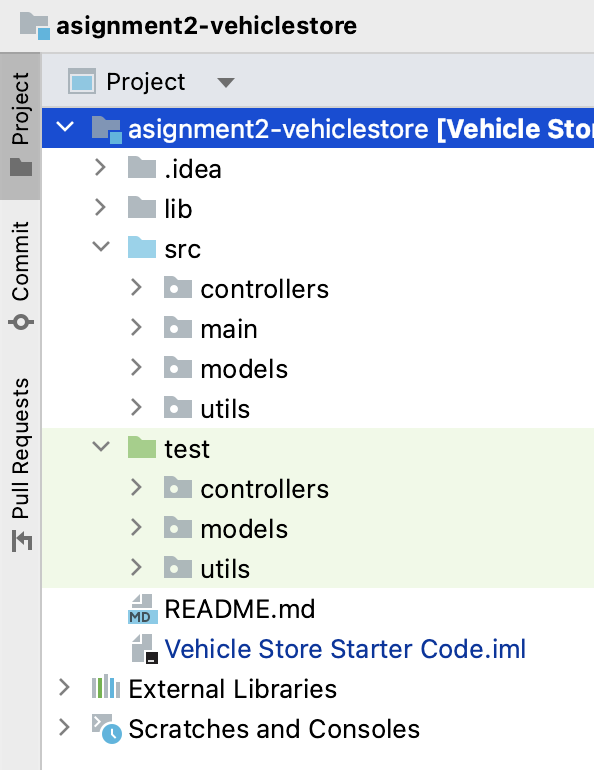

#14. Running the Tests

### Test Folder is Excluded

- The test folder is coloured orange in your skeleton code.  This means that it is excluded and cannot be "seen" by the compiler or the JUnit test runners.

### Including the Test Folder

- To run your tests, you need to include the test folder by following these steps:

1. Right click on the orange test folder and "cancel exclusion":

2. Your test folder will now be grey:

3.  Right click on the grey test folder and "Mark Directory As", "Test Sources":

4. The test folder will now be green and you can now run your tests as normal:

### Delete the out folder

The orange "out" folder is generated by the compiler.  

You can delete this by right clicking on it and selecting "delete":

Confirm that you want to delete the folder (it will be regenerated when you compile again)

### Folder Structure

Your folder structure should now look like this:

