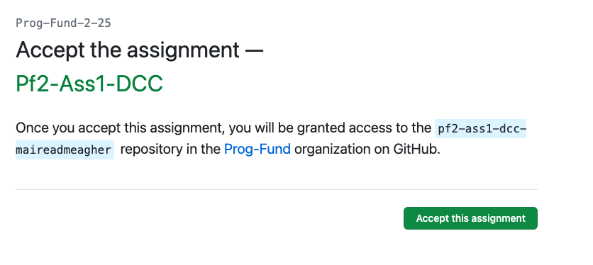
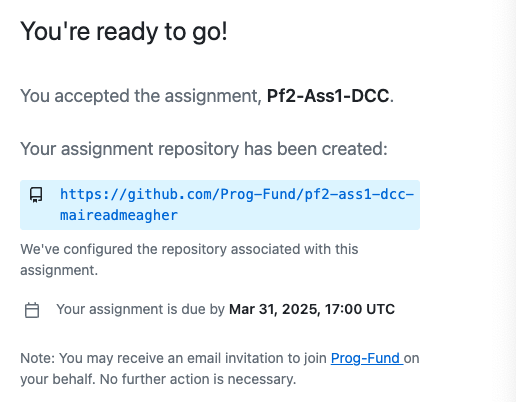
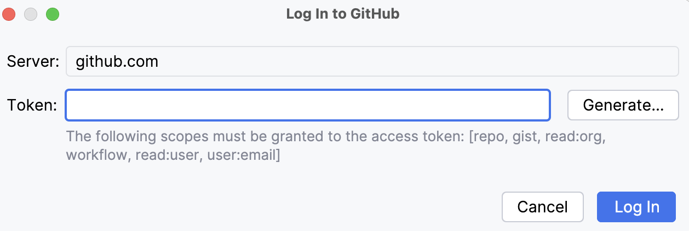
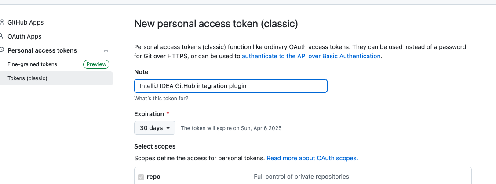

# 4. Accepting the Assignment

**If you haven't done the Formative Assignment, please do that first.  The steps below are based on you having already joined the GitHub classroom.**

The  assignment is called **Pf2-Ass1-DCC**.

To start working on it, click on this invite link:

<https://classroom.github.com/a/58Akv87X>

You may be prompted to authorise GitHub classroom - accept this and then you will be invited to Accept the Assignment

Once you do this, you will be redirected to join the classroom:

When your repository has been configured, you will be shown a list of names, one of which should be yours. Select your name from the list and then *accept this assignment*:

When you refresh the page, you should see that a repo has been created for you (your name will be at the end of the repo url):

# IntelliJ and GitHub

You should now have a repository created in our classroom.  Click on your unique link (it will be different to our one, as it will have your GitHub user name instead of maireadmeagher):

You will be taken to your remote repository where you will work on the assignment:

To work on the assignment, you need to download a local copy of this to your computer, via IntelliJ.

## Remote URL

In the above screen shot, you can see that the URL for **OUR** private remote repository is:

- <https://github.com/Prog-Fund/pf2-ass1-dcc-maireadmeagher>

You WON'T have access to our URL - this is Mairead and Siobhans one.  

Instead, you use your own personal URL to the repo that was just generated.  It will be along this format i.e.:

- https://github.com/Prog-Fund/pf2-ass1-dcc-YOUR-GITHUB-ID

Make a note of **your** URL...you will need this in a few moments (and also later in the lab). If you are having trouble finding your URL, just to go your GitHub account and you should find the repo in there.

## IntelliJ: Linking to your Remote Repo

Launch IntelliJ.

When the splash screen appears, you will notice there are three options:

So far, you have used the first two:

- New Project
- Open

You will now use the thid option: **Get from VCS** OR **Clone Repository** (Note: VCS stands for Version Control Software...this is what GitHub is).

Click on the **Get from VCS** OR **Clone Repository** button and the following dialog will be shown:

Choose 'Use Token'

You will see : 

Press Generate - this will bring you to the following page : 

Go down to the end of of that page and click on 'Generate Token'. You will then see a screen with the token. Copy this (as suggested) and when you go back to Intellij you will be asked to paste the token (that you have just copied). Once you have done that, the Clone shoud happen and download the starter code for you. 

**Make sure that your project looks the same as our screen shot above before continuing.**

