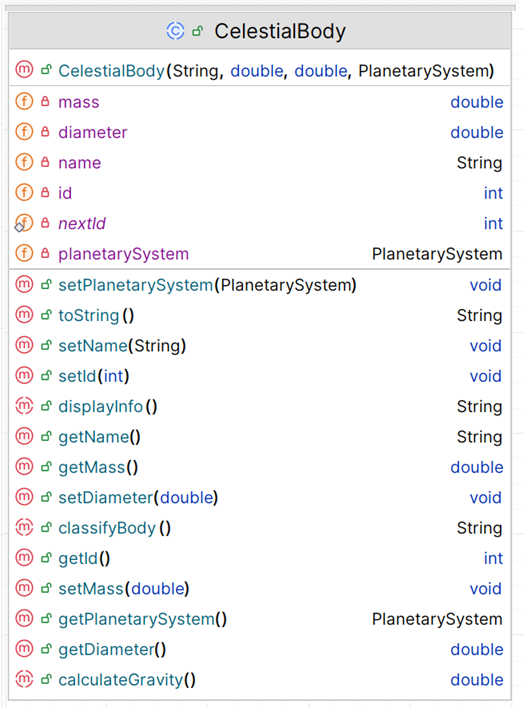

# 5. Celestial Body class

A celestial body is any object that astronomers observe in outer space.
They are also sometimes referred to as "celestial objects", "astronomical objects", or "heavenly bodies."
This can include planets, stars, moons, asteroids, comets, or even nebulae and galaxies.

This is the super class in the hierarchy.  The responsibility for this *abstract* class is to manage a Celestial Body.  The UML is here:

NOTES: 

- You may add additional instance fields of your choice (for extra credit!).  If you do so, the method list and parameters for existing methods will change/grow. 
- The **Hierarchy Overview** tab has generic information on coding constructors, getters, setters and toString.  The information below is just the specifics related to this class.

---

## Fields

The following are private fields in the CelestialBody class:

|      Property                |         Value          |        Default Value   |        Description  |
|------------------------------|------------------------|------------------------|------------------------|
| id                           | >= 1000                | 1000                    |generated when an object is created using nextId |
| name                         | Jupiter                | truncates to 30 chars   | max 30 chars   |
| mass                        | 6.0                   |         0.1               |measured in ronnagrams earth is approx 6.0rg must be > 0.1 default to 0.1  |
| diameter               | 1                  |0.5                     |  measured in kilometres must be > 0.5 default to 0.5 |
| planetarySystem                          | Planetary System object                   | null                          | must be a valid system e.g Solar System  |

The following is a static private field in the CelestialBody class:

|      Property                |         Value          |        Default Value   |        Description  |
|------------------------------|------------------------|------------------------|------------------------|
| nextId                           | 1000               | 1000                    |This field is used to create the id, it is incremented by 1 everytime a new Celestial Body is created |

## Constructor Signature

~~~
   public CelestialBody(String name, double mass, double diameter, PlanetarySystem planetarySystem)
~~~

## Abstract method

There are three abstract methods in this class (the three concrete classes will provide the implementation for it):

- displayInfo()
- calculateGravity()
- classifyBody()

The return type for these methods can be read from the UML structure above.

## toString method

This method should build a one line string containing the object information and return it (note: no \n should be included in the String):

## JUnit Test Class

The Test Class for **CelestialBody** (CelestialBodyTest.java) is included in the starter code and fully written. Because CelestialBody is an abstract class, the test Class creates a Star instance and tests the technology fields only of it. So to run this 'CelestialBody' test you also need to have Star started (even dummy methods as per UML will do to get started)
