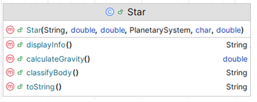

# 7a. Star class

The responsibility for this *concrete* class is to extend StellarObject and implement the class for a Star.  The UML is here:

NOTES: 

- You may add additional instance fields of your choice (for extra credit!).  If you do so, the method list and parameters for existing methods will change/grow.  
- The **Hierarchy Overview** tab has generic information on coding constructors, getters, setters and toString.  The information below is just the specifics related to this class.

---

## Fields

There are no extra fields in this class:

## Constructor

There is one constructor for this class.  The parameter list for this constructor should be the same as the parameter list for the StellarObject class.  The constructor should call the superclass constructor.

## Abstract methods

`calculateGravity` - this method returns a (double) value for the gravity.  The algorithm for calculating this is: 
~~~
        // Algorithm - 
        //  (mass multipled by 6.67430e-11) divided by (half the diameter to the power of 2)
~~~

`displayInfo` - this method returns a String 
~~~
        // return the String with the field information
        e.g. Star: Sun, Spectral Type: O, luminosity: 1200;
        
~~~
`classifyBody` - this method returns a String 
~~~
        // return the String with the the text "Star" in it
        
~~~
## toString method

the toString() method should add the gravity information and call its super classes toString()

## JUnit Test Class

This class will be given to you

