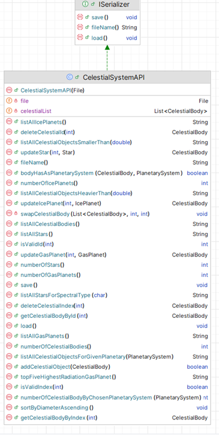

# 10. CelestialSystemAPI class 

This API class is responsible for storing and managing ALL the Celestial System in the system. 

This UML here is starter UML - depending on the menu items you include in your Driver class, the methods here will grow / change:

There is starter code for CelestialSystemAPI in the Starter Code you are given.

---

## Fields

There are two private fields, 
 - *celestialList*, which is an ArrayList of *CelestialBody*;
 - *file* , the file that Celestial Bodies will be saved to /loaded from.

---

## Basic CRUD on celestialList ArrayList

### addCelestialObject (with the new CelestialBody as a parameter)
This method will add a CelestialBody object (passed as a parameter) to the ArrayList *celestialList*.  There is no validation in this method.  
Returns true if the CelestialBody was added and false if not. 

### deleteCelestialIndex (with index - position of celestial body in array list as parameter)
  This method removes an celestial body object at the location *index*, which is passed as a parameter.  There is some validation in this method.  
  - Check that the passed index exists in the ArrayList:
      - if it does exist, remove it from the ArrayList and return *the object that was just deleted*.
      - if the passed index is not valid, return *null*. 

### deleteCelestialId (with id of celestial body as parameter)
  This method removes an celestial body object with the id which is passed as a parameter.  There is some validation in this method.  
  - Check that the passed id exists in the ArrayList:
      - if it does exist, remove the corresponding celestial body  from the ArrayList and return *the object that was just deleted*.
      - if the passed index is not valid, return *null*. 

### getCelestialBodyByIndex (with index - position of celestial body in array list as parameter)
 This method returns an celestial body object at the location *index*, which is passed as a parameter.  There is some validation in this method.  
  - Check that the passed index exists in the ArrayList:
      - if it does exist, return *the object at that position*.
      - if the passed index is not valid, return *null*. 

### getCelestialBodyById (with id of celestial body as parameter)
 This method returns a celestial body object with that exact *id* (ignoring case), which is passed as a parameter.  There is some validation in this method.  
  - Check that the passed *id* exists in the ArrayList:
      - if it does exist, return *the object with that id*.
      - if the passed id is not found, return *null*. 

---

## Reporting Methods

### listAllCelestialBodies()
This method should return a String containing the details of all the celestial body in **celestialList** along with the index number associated with each celestial body.  If no celestial body exist yet, **"No Celestial Bodies"** should be returned.

### listAllGasPlanets()
This method should return a String containing the details of all the Gas Planets in **celestialList** along with the index number associated with each gas planet.  If no gas planet exist yet, **"No Gas Planets"** should be returned.

### listAllIcePlanets()
This method should return a String containing the details of all the Ice Planets in **celestialList** along with the index number associated with each Ice Planets.  If no Ice Planets exist yet, **"No Ice Planets"** should be returned.

### listAllStars()
This method should return a String containing the details of all the Stars in **celestialList** along with the index number associated with each Star.  If no Stars exist yet, **"No Stars"** should be returned.

### listAllStarsForSpectralType(with char as a parameter)
This method should return the list of stars for that spectral type .
 
- If no such celestial body exist, **"No stars for spectral type ??"** (include type).

### listAllCelestialObjectsHeavierThan(with weight(double) as a parameter)
This method should return the list of celestial body equal or above  the entered weight.
 

- If no such celestial body exist, **"No celestial body heavier than ??"** (include weight).

### listAllCelestialObjectsSmallerThan( with a double for diameter as a parameter)
This method should return a String containing the details of all the celestial body in **celestialList** whose diameter is equal to or less than that passed in as parameter. 
If no such celestial body exist, **" "No celestial body smaller than ??"** should be returned. 

### listAllCelestialObjectsForGivenPlanetary( with a  PlanetarySystem as a parameter)
This should return a String containing all the celestial bodies that have the same PlanetarySystem as the one passed in as a parameter. 
If invalid system return **"Invalid Planetary System**  If no such celestial objects exist, **"No celestial body in the "+ PlanetarySystem ** should be returned.

### numberOfCelestialBodies()
This method returns the number of celestial body in the system (in **celestialList**). 

### numberOfStars()
This method returns the number of stars in the system (in **celestialList**). 

### numberOfIcePlanets()
This method returns the number of ice planets  in the system (in **celestialList**). 

### numberOfGasPlanets()
This method returns the number of gas planets in the system (in **celestialList**). 

### numberOfCelestialBodyByChosenPlanetarySystem(with a PlanetarySystem passed in as a parameter)
This method returns the number of  celestial body  in the system (in **celestialList**) whose PlanetarySystem is that passed in. 

---

## Update Methods 

### updateStar(int id, Star updatedDetails)  
This method takes in a id and replaces the corresponding  object with the Star as input (updatedDetails).

### updateGasPlanet(int id, GasPlanet updatedDetails)
This method takes in a id and replaces the corresponding  object with the GasPlanet as input (updatedDetails).

### updateIcePlanet(int id, IcePlanet updatedDetails) 
This method takes in a id and replaces the corresponding  object with the IcePlanet as input (updatedDetails).

## Validation Methods

### isValidId(int id)
This method  returns 
  - **true** if that id does  exist in the **celestialList** collection
  - **false** if that id does  not exist in the **celestialList** collection

### isValidIndex(int id)
This method  returns 
  - **true** if that index  does not exist in the **celestialList** collection
  - **false** if that index does not  exist in the **celestialList** collection

---

## Sorting Methods

**Note** No marks will be given if you use library sort methods, i.e. you need to adapt the sort code given in class so that it applies to the particular data structure and the particular sort. 

### sortByMassDescending()
This method should change the celestialList object so that it is sorted by mass in descending order. 

### sortByDiameterAscending()
This method should change the celestialList object so that it is sorted by diameter in ascending order.

### swapCelestialBody (List<CelestialBody> celestialList, int i, int j)
This should be a private method that swaps the objects at positions i and j in the collection **celestialList**. This method should be used in your sorting method. 

## Other Methods
### topFiveHighestRadiationGasPlanet()
 - returns a List of the top 5 most radiated gas planets
 

### bodyHasAsPlanetarySystem(CelestialBody cb, PlanetarySystem ps)
 This method  returns 
  - **true** if the celestial body cb has ps as its planetary system
  - **false** otherwise

---

## Persistence

All of the persistence methods are supplied in the starter code.  

**TODO:** make sure you implement the ISerializer interface in CelestialSystemAPI 

### save
This method saves all celestial body objects from the ArrayList  to an XML file *celestialBody.xml*.  

### load
This method loads all saved objects back into the program (i.e into the ArrayList celestialList) from the XML file *celestialBody.xml*.  

### fileName()
This method should return the file that the celestialList collection is saved to/load from. 

---

## JUnit Test Class

A partial test class for CelestialSystemDeviceAPI given in the Starter Code

You are asked to complete the given test class.  

You can check how complete your updated test class is by using the **Coverage** Tool in **Intellij**. 

---
