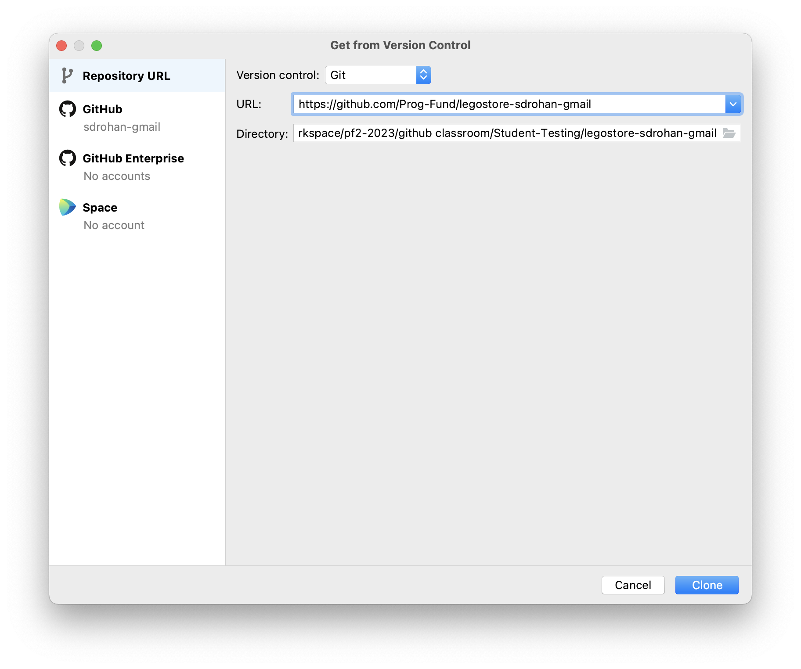
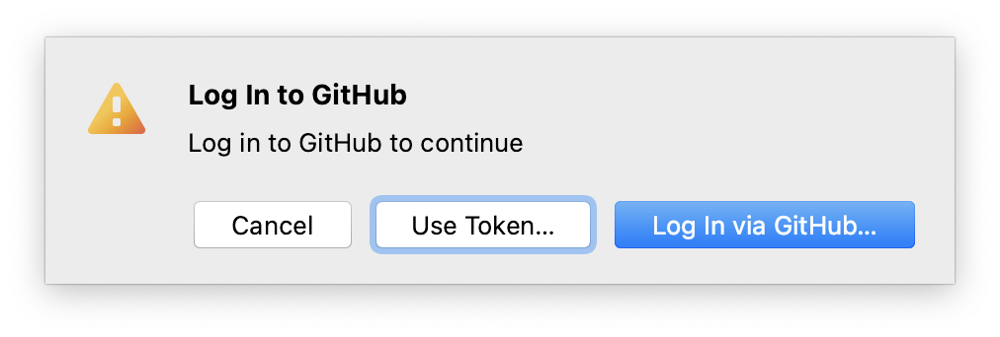
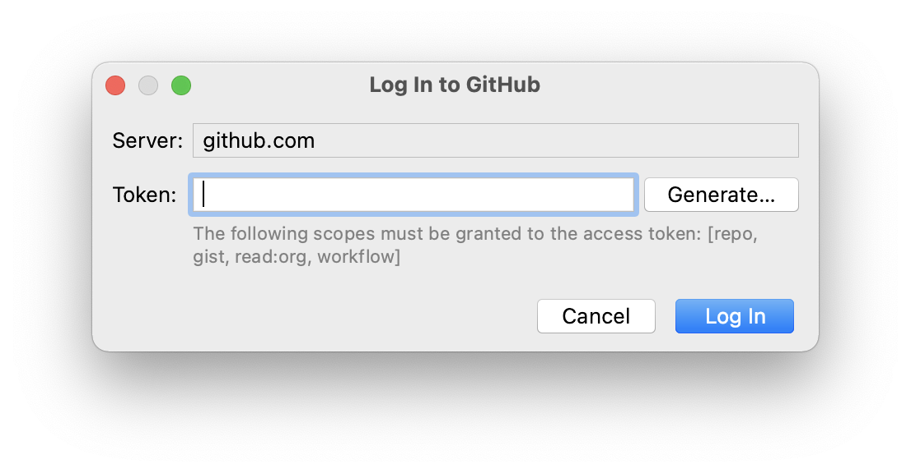
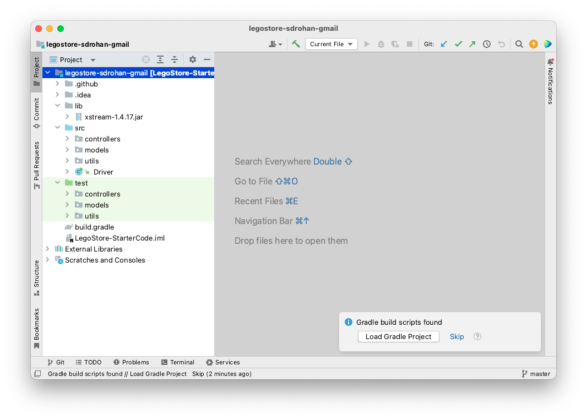

# 2. Clone via IntelliJ
**TO BE DONE**

Launch IntelliJ and click **Get from VCS**.

With **Repositorty URL** highlighted on the left hand side, paste the link to your remote repository into the **URL** box:

 

Then choose a location on your computer for the local copy of the code to reside (OneDrive if you are using college computers).  

Click the **Clone** button.

## Authenticate yourself

You should be asked to authenticate your GitHub account:

 

If the "Login via GitHub" results in a failed clone, then you will need to restart the clone above and this time, choose the "Use Token" option. 

 

When you click on the "Generate..." button, you will be brought to your browser, where you can select "90 days" or more as your Expiration date.  Then scroll down and click the "Generate Token" button.

Copy the token, return to IntelliJ and paste it into the Token field.  Then click Log In.  

## Cloning will start...

Your project should start cloning successfully now. When you are aksed if you trust the project...you do.

A local copy of the remote project should now open in IntelliJ.  It should look like this:

DO **NOT** CLICK ON THE MESSAGE `Load Gradle Project`

**Click the Skip option**.

If you did click on the `Load Gradle Project` link, you will alter the entire file structure of your project...if you did this, delete your local project from your windows explorer / mac finder and just clone it again. 

**Make sure that your project looks the same as our screen shot above before continuing.**

**If you are prompted at any stage to `Load Gradle Project`....DON'T...choose the Skip option**
