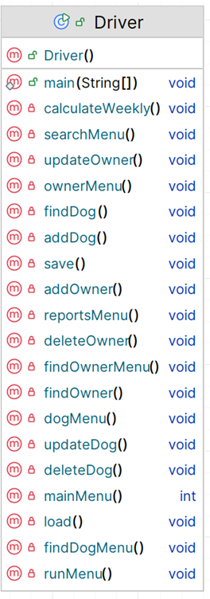

# UML Diagrams

This is the list of UML diagrams which lists the UML diagrams for the classes and methods that will compile with the tests. In case of discrepancies between the TODOs in the code and the signatures below (the same as expected in the tests).

The following are UML diagrams for the classes in the Assignment. In these diagrams :

## Owner

 

## Dog

 

## DayCare

 

## Driver

**Sample - you design your own Driver**
 