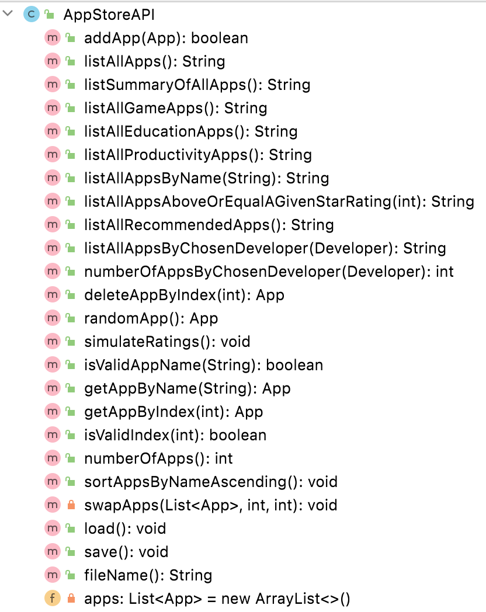

#AppStoreAPI class 

This API class is responsible for storing and managing ALL the Apps in the system. 

This UML here is starter UML - depending on the menu items you include in your Driver class, the methods here will grow / change:

There is starter code for [AppStoreAPI](archives/AppStoreAPI.java).

---

## Fields

There is one private field, *apps*, which is an ArrayList of App. 

---

## Basic CRUD on apps ArrayList

### addApp (with the new app as a parameter)
This method will add an App object (passed as a parameter) to the ArrayList *Apps*.  There is no validation in this method.  Returns true if the app was added and false if not. 

### deleteAppByIndex (with index - position of app in array list as parameter)
  This method removes an App object at the location *index*, which is passed as a parameter.  There is some validation in this method.  
  - Check that the passed index exists in the ArrayList:
      - if it does exist, remove it from the ArrayList and return *the object that was just deleted*.
      - if the passed index is not valid, return *null*. 

### getAppByIndex (with index - position of app in array list as parameter)
 This method returns an App object at the location *index*, which is passed as a parameter.  There is some validation in this method.  
  - Check that the passed index exists in the ArrayList:
      - if it does exist, return *the object at that position*.
      - if the passed index is not valid, return *null*. 

### getAppByName (with name - name of app as parameter)
 This method returns an App object with that exact *name* (ignoring case), which is passed as a parameter.  There is some validation in this method.  
  - Check that the passed *name* exists in the ArrayList:
      - if it does exist, return *the object with that name*.
      - if the passed name is not found, return *null*. 

---

## Reporting Methods

### listAllApps()
This method should return a String containing the details of all the apps in **apps** along with the index number associated with each app.  If no apps exist yet, **"No apps"** should be returned.

### listSummaryOfAllApps()
This method should return a String containing the summary of all the apps in **apps** (use the **appSummary()** method as defined in App class).  The index number of each app should be included in the string too.
If no apps exist yet, **"No apps"** should be returned.

### listAllGameApps()
This method should return a String containing the details of all the Game apps in **apps** along with the index number associated with each app. If no such apps exist, **"No Game apps"** should be returned.

### listAllEducationApps()
This method should return a String containing the details of all the Education apps in **apps** along with the index number associated with each app. If no such apps exist, **"No Education apps"** should be returned.

### listAllProductivityApps()
This method should return a String containing the details of all the Productivity apps in **apps** along with the index number associated with each app. If no such apps exist, **"No Productivity apps"** should be returned.

### listAllAppsByName(with name(String) as a parameter)
This method should return the list of Apps whose appName *contains* the name (case insensitive) passed as a paramenter.  If no such apps exist, **No apps for name "appName"** exists.

### listAllAppsAboveOrEqualAGivenStarRating( with int rating as a parameter)
This method should return a String containing the details of all the apps in **apps** which have a rating equal to or above the rating passed as a parameter.  If no such apps exist, **"No apps have a rating of " + rating + " or above"** should be returned. 

### listAllRecommendedApps()
This should return a String containing all the apps that are **recommended** (according to the specific sub-class algorithms).  If no such apps exist, **"No recommended apps"** should be returned.

### listAllAppsByChosenDeveloper(with a developer object given as parameter) 
This method searches through the apps collection for the apps whose developer field matches the developer object (given as parameter). If no such apps exist, **"No apps for developer: " + developer** should be returned.

### numberOfAppsByChosenDeveloper(with a developer object given as parameter)
This method returns the number of Apps writted by a given developer. 

### randomApp(with no parameter)
This method should return a random App from the collection of apps. If no apps are in the collection, **null** should be returned. 

## simulateRatings(with no parameter)
This method is written for you.  It randomly allocates a generated rating to each app in the collection. 

---

## Validation Methods

### isValidIndex( with index - position of app in apps as parameter)
This method is written for you.  It returns 
  - **true** if that index exists in the **apps** collection
  - **false** if that index does not exist in the **apps** collection
(This method can be used to implement *getAppByIndex(..)* below)

### isValidAppName( with name - name of app  as parameter)
This method will return 
  - **true** if an App with that name exists
  - **false** if no App with that name exists
(This method can be used to implement *getAppByName(..)* below)

---

## Sorting Methods

### sortAppsByNameAscending()
This method should change the apps object so that it is sorted by name in ascending order. 

### swapApps (List<App> apps, int i, int j)
This should be a private method that swaps the objects at positions i and j in the collection **apps**. This method should be used in your sorting method. 

---

## Persistence

All of the persistence methods are supplied in the starter code.  

**TODO:** make sure you implement the ISerializer interface in AppStoreAPI (and also DeveloperAPI).

### save
This method saves all App objects from the ArrayList Apps to an XML file *apps.xml*.  

### load
This method loads all saved App objects back into the program (i.e into the ArrayList apps) from the XML file *apps.xml*.  

### fileName()
This method should return the file that the apps collection is saved to/load from. 

---

## JUnit Test Class

A partial test class for AppStoreAPI given [here](archives/AppStoreAPITest.java). 

You are asked to complete the given test class.  

You can check how complete your updated test class is by using the **Coverage** Tool in **Intellij**. 

---