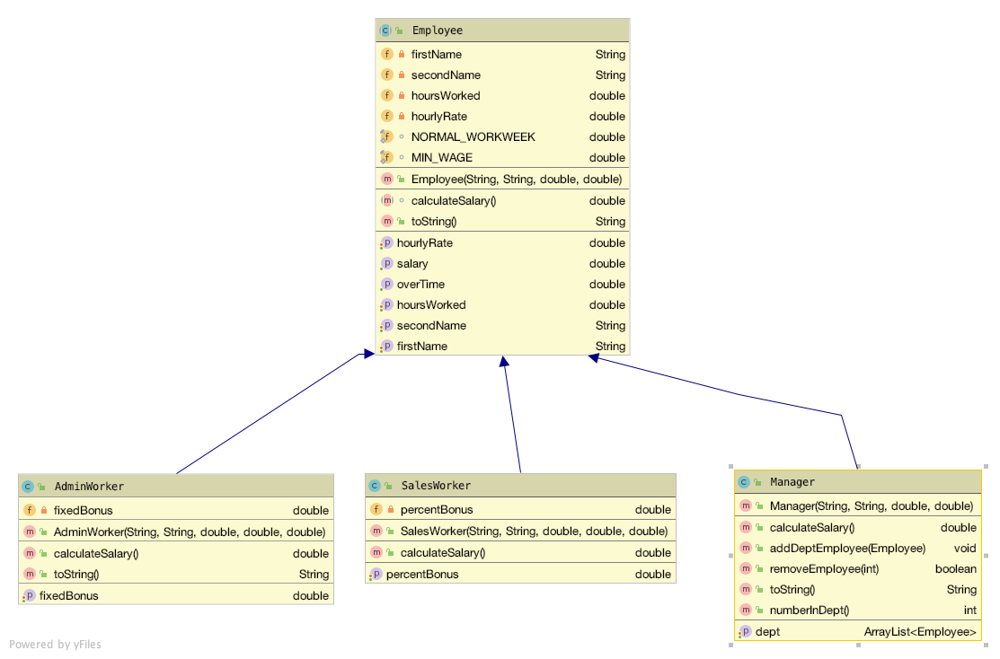

#Employee hierarchy

The classes in the **Employee** hierarchy are each described below.  Note:

- Use IntelliJ to generate, where applicable, *constructors*, *accessors* and *mutators* methods. 

- The toString method should return the current object state as well as the object state in any of its super classes.  

##Employee

An abstract class that manages common information for an employee.  This is the super class of the Employee hierarchy.

##AdminWorker

A concrete class that manages the Admin Worker details. It stores the Admin Worker's fixed bonus. This extends the Employee class.

##SalesWorker

A concrete class that stores the percentage bonus (0->20%) of their salary that the sales worker is given.  This class extends Employee.

##Manager

A concrete class that stores an ArrayList of employees who this manager manages. The manager is given a bonus of 1% of the total salaries of his/her employees. 

