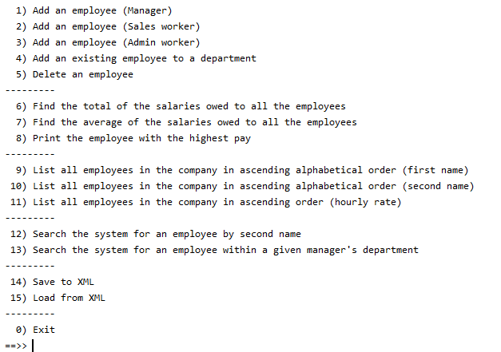
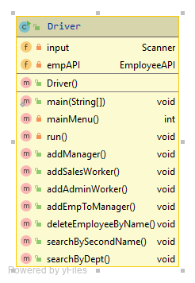

#Driver class

The responsibility of the Driver class is to run the app and perform I/O with the user.   

In this class, create an object of the *EmployeeAPI* class.  Hint:  use the ShopV5.0 driver as a guide for completing this class.  

##Menu

A suggested menu is:

When writing this class, the above menu is just a suggestion.  You may deviate from this menu as you wish.  If you provide more elaborate menu items/reports, you will need to add more methods to the EmployeeAPI class; remember, avoid the temptation to make the ArrayList in EmployeeAPI public as this would break encapsulation rules.      

If you do deviate from the suggested menu, ensure that you still have the following basic elements on the menu:

- CRUD on the Employee list
- reporting and
- persistence

For more direction, please refer to the rubric in the indicative marking scheme tab to see how we are grading the Driver class, the EmployeeAPI class and the JUnit testing of the EmployeeAPI class.  In particular, please note that 100% in this assignment will require you to provide methods in EmployeeAPI with associated menu items in Driver beyond what we have outlined in this spec.  These additional methods will also need to be JUnit tested.    

##A note on I/O

Aside from the ScannerInput class (if you are using it),  this class should be the only class that has:

- System.out.print statements
- Scanner objects defined. 

##Methods for Driver
The UML for the Driver class is here:

##Fields

There are two private fields in the *Driver* class:

- **input**: This is an object of the *Scanner* class.  
- **empAPI**:  This is an object of the EmployeeAPI class. (

##main method

The main method has two lines of code:

~~~
	Driver app = new Driver();
	app.run();
~~~

##Constructor

We will write a default constructor for this class.  There are two lines of code in this method:

~~~
public Driver() {
    	input = new Scanner(System.in);
		empAPI = new EmployeeAPI();
	}
~~~

