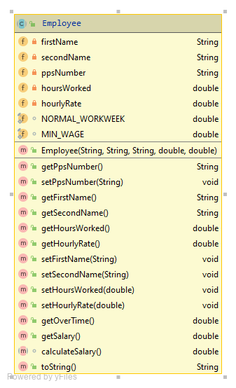

#Employee class

The UML for the party class is here:

The responsibility for this class is to manage an Employee. This should be an abstract class.  

##Fields

There are four private fields in the Employee class.  The validation on these fields is as follows:

- *firstname*: The firstname is maximum 10 characters.

- *secondname*: The secondname is maximum 10 characters.

- *hoursWorked*: This must be non-negative

- *hourlyRate*: This must be at least the MIN_WAGE (9.80).

##Constructor

There is one constructor that should have the same method signature as the diagram above.  The constructor should enforce the validation rules outlined for each field above.

##Methods (getters and setters)

Each of the above fields will have a getter and a setter.  The setters should adhere to the validation rules outlined above.  Remember that a setter should not apply a default value i.e. if an negative value for *hoursWorked* is entered, do not overwrite the existing stored *hoursWorked*. toString() should also be written. 

##Methods (getOverTime)
This method should re
turn the amount owed to the employee for overtime. This is calculated by multiplying the number of hours over the 'NORMAL_WORKING_WEEK' (i.e.39.5 hours) worked by the employee by the hourlyRate\*2.

##Methods (getSalary)
This method returns the basic salary(hourly-rate * amount <= 'NORMAL\_WORKING\_WEEK') + overtime  (see above) based on hours worked (i.e. no bonuses included).

##Methods (calculateSalary)
This (abstract) method promises that any concrete subclass of Employee will implement this method. This method will calculated the total salary including bonuses. 

##Methods (toString)
This method returns a string version of this object.