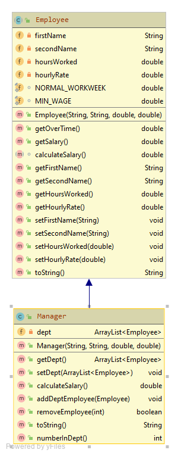

#Manager class

The UML for the manager class is here:

The responsibility for this (concrete) class is to extend Employee and implement the class for a manager

#Fields

There is one private fields in the Manager class and is described as follows:

- *dept*: A collection (ArrayList) of Employees's. in this manager's department. Thes employees should already be in the employees list

##Constructor

There is one constructor that should have the same method signature as the diagram above.  The constructor should call the superclass consructor and also instantiate the dept ArrayList/.

##Methods (getters and setters)

The above field should have a getter and setter.  There are no validation rules for this setter. 

##calculateSalary()
This takes the salary calculated by the superclass's **getSalary**  and adds it to the managers bonus, defined as follows: 
The managers bonus is calculated by adding 1% of each of his/her full salaries(including their bonuses)

##addDepartmentEmployees(Employee object)
This should add an Employee object to this manager's department. 

##removeEmployee(int i)
This should remove the Employee object at position i (if it exists). If a sucessful delete takes place, then return true, otherwise false. 

##numberinDept() 
this should  return the number of Employee's currently in this department. 

