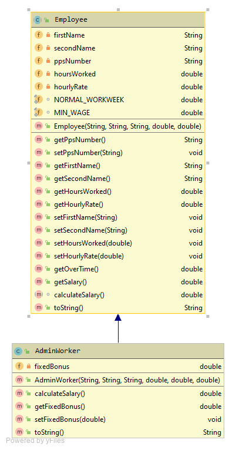

#AdminWorker class

The UML for the manager class is here:

The responsibility for this (concrete) class is to extend Employee and implement the class for a Sales Worker

#Fields

There is one private fields in the Manager class and is described as follows:

- *fixedBonus*: This is a fixed (non-negative)

##Constructor

There is one constructor that should have the same method signature as the diagram above.  The constructor should call the superclass consructor and also instantiate the fixedBonus (with validation)

##Methods (getters and setters)

The above field should have a getter and setter.  Use the validation rules for the setter. 

##calculateSalary()
This takes the salary calculated by the superclass's **getSalary**  and adds it to the fixed Bonus bonus.

