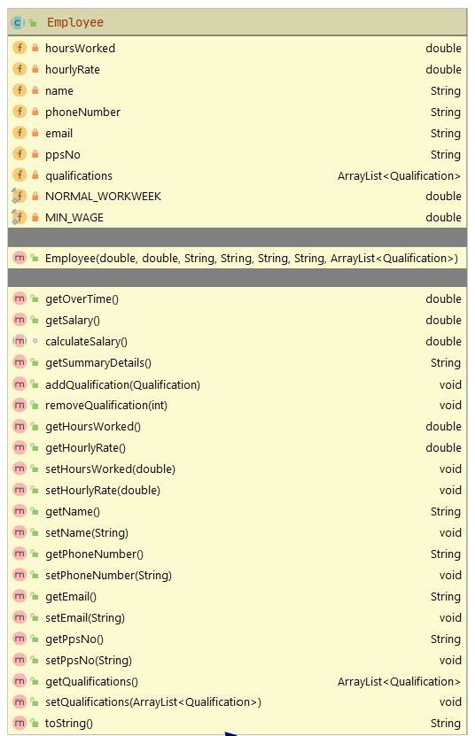
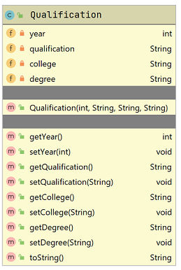

#Employee class (and new Qualificaiton class)

The responsibility for this class is to manage an Employee. This should be an abstract class.  

Starter UML for the Employee class is here:

Please note that you can add more instance fields, should you wish.  This will mean that your method list and parameters for existing methods, will change and grow.

##Fields

There are two private static fields in this class:

- *NORMAL_WORKWEEK*: double
- *MIN_WAGE*: double

There are (at least) these private fields in the Employee class:

- *hoursWorked*: must be non-negative
- *hourlyRate*: must be at least the MIN_WAGE (9.80)
- *name*: must be max 50 chars
- *phoneNumber*: Must contain numbers only
- *email*: must contain @ and .
- *ppsNo*: must contain 8 characters only (first 7 chars are numbers, last char must be a letter).
- *qualifications*: an array list of qualifications (see Qualification class details below)

##Constructor

There is one constructor that should take in the non-static fields, as per screen shot above.  The constructor should enforce the validation rules outlined for the fields above.  Apply a sensible default here when invalid data is passed into the constructor.

##Methods (getters and setters)

Each of the fields will have a getter and a setter (including the two static fields).  The setters should adhere to the validation rules outlined above.  Remember that a setter should not apply a default value i.e. if an negative value for *hoursWorked* is entered, do not overwrite the existing value stored in *hoursWorked*. 

##toString() 
A toString() method should be written that will return a String representation of your object state.

##Methods (getOverTime)
This method should return the amount owed to the employee for overtime. This is calculated by multiplying the number of hours over the 'NORMAL_WORKING_WEEK' (i.e.39.5 hours) worked by the employee by the hourlyRate\*2.

##Methods (getSalary)
This method returns the basic salary(hourly-rate * amount <= 'NORMAL\_WORKING\_WEEK') + overtime  (see above) based on hours worked (i.e. no bonuses included).

##Methods (calculateSalary)
This (abstract) method promises that any concrete subclass of Employee will implement this method. This method will calculated the total salary including bonuses. 

##Methods (getSummaryDetails)
This method returns a string in this format **Siobhan Drohan (sdrohan@wit.ie, 08435233).  PPS: 4536534T.**

##Methods (to add, remove and retrieve from qualifications ArrayList)

Add a method that will:
1. add a qualification to the arrayList.
2. remove by index number (verify the index number is valid).
2. retrieve by index number (verify the index number is valid).

#Qualification class

Create a new class based on the UML below.

Ensure that the following fields and validation are included:

- *year*: must be four numbers long and begin with 19 or 20, default 1900
- *qualification*: must be either BSc, MSc, PhD, defaut UNKNOWN
- *college*: no validation on college name
- *degree*: no validition on degree name

Ensure that the methods listed in the UML are also included, and that field level validation is applied appropriately.

