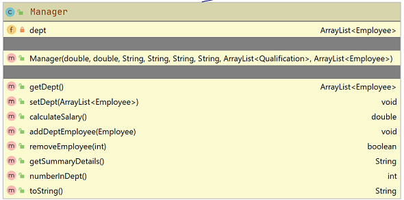

#Manager class

The responsibility for this (concrete) class is to extend Employee and implement the class for a manager.  Should you wish, you may add additional fields to this class. 

#Fields

There is one private field in the Manager class:

- A collection (ArrayList) of Employees in this manager's department. The employees should already be in the employees list (see EmployeeAPI).

##Constructor

There is one constructor.  

The parameter list for this constructor should be the same as the parameter list for the Employee class.  The constructor should call the superclass consructor and also instantiate the ArrayList of Employees.

##Methods (getters and setters)

The above field should have a getter and setter.  There are no validation rules for this setter. 

##calculateSalary()

This takes the salary calculated by the superclass's **getSalary**  and adds it to the managers bonus, defined as follows: 

- The managers bonus is calculated by adding 1% of each of his/her employees' full salaries (including their bonuses).

##getSummaryDetails()

Override the getSummaryDetails() from employee so that the following String is returned, along with the associated salary e.g. *Siobhan Drohan (sdrohan@wit.ie, 08435233).  PPS: 4536534T.  Salary: €1,234,567.* 

##Other ArrayList Methods 

- Write a method that will add an employee object to the department arraylist above.

- Write a method that: 

	- has an index parameter of type int.
	- removes the Employee object at the given index (if it exists). 
	- returns true if a sucessful delete takes place, otherwise false. 

- Write a method that returns the number of Employee's currently stored in the department ArrayList. 

