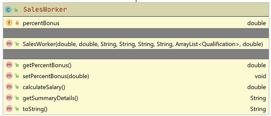

#SalesWorker class

The responsibility for this (concrete) class is to extend Employee and implement the class for a Sales Worker.  Should you wish, you may add additional fields to this class.

#Fields

There is one private double field in the SalesWorker class:

- The field will be used to store the percentage of their salary that will be their bonus.  Validation wise, it is a percent value (between 0 and 20% inclusive).

##Constructor

There is one constructor for this class. 

The parameter list for this constructor should be the same as the parameter list for the Employee class but with one additional field (for the percent bonus above).  

The constructor should call the superclass consructor and also instantiate the percent bonus field (with validation).

##Methods (getters and setters)

The above field should have a getter and setter.  Use the validation rules for the setter. 

##calculateSalary(), returns a double

This takes the salary [calculated by the superclass's **getSalary**], adds it to the Sales Worker's bonus and returns it.  

An example of how the final salary is calculated:

    - getSalary() salary = 200
    - percentage bonus = 13% i.e. calculates as 26
    - Final returned salary is 200 + 26 = 226.

##getSummaryDetails()

Override the getSummaryDetails() from employee so that the following String is returned, along with the associated salary e.g. *Siobhan Drohan (sdrohan@wit.ie, 08435233).  PPS: 4536534T.  Salary: €1,234,567.* 
