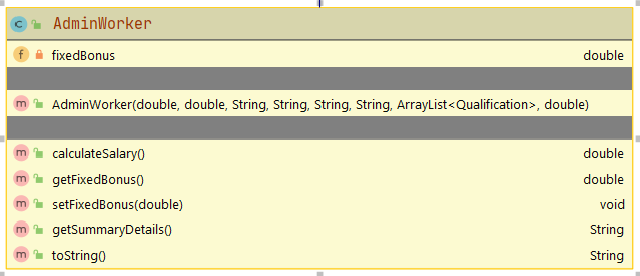

#AdminWorker class

The responsibility for this (concrete) class is to extend Employee and implement the class for a Sales Worker.  Should you wish, you may add additional fields to this class.

#Fields

There is one private double field in the AdminWorker class:

- The field will be used to store the fixed bonus amount for the AdminWorker.  Validation wise, this field cannot be non-negative.

##Constructor

There is one constructor for this class. 

The parameter list for this constructor should be the same as the parameter list for the Employee class but with one additional field (for the fixed bonus amount above).  

The constructor should call the superclass consructor and also instantiate the fixed bonus amount field (with validation).

##Methods (getters and setters)

The above field should have a getter and setter.  Use the validation rules for the setter. 

##calculateSalary(), returns a double

This method takes the salary calculated by the superclass's **getSalary**, add it to the fixed bonus amount and returns it. 

##getSummaryDetails()

Override the getSummaryDetails() from employee so that the following String is returned, along with the associated salary e.g. *Siobhan Drohan (sdrohan@wit.ie, 08435233).  PPS: 4536534T.  Salary: €1,234,567.* 

