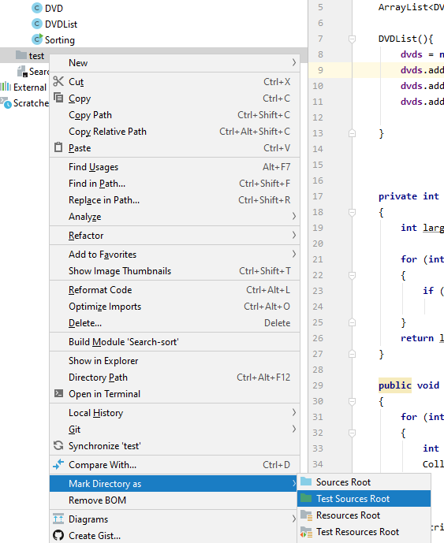

#JUnit

The following steps will show you how to set up JUnit. 

##Creating a Test Folder

In your IntelliJ project, right click on your project name. 

When the context menu appears, select *New --> Directory*.  

Call the new directory *test*.  

Note that the *src* folder is blue in colour and the *test* one is grey:

We need to 'mark' this directory as a test source folder.  To do this, right click on the new *test* folder and when the context menu appears, select *Mark Directory as --> Test Sources Root*: 

Your *test* directory should now be green in colour.

##Creating a test class

Instead of generating test classes, you should drag in the supplied test classes. 

You will notice that a lot of errors exist in the newly added test classes in relation to the *JUnit* imports *annotations* and the *assert* methods:

We need to add JUnit to our classpath so that these imports and methods can be recognised.  To do this, click on one of the JUnit imports that is causing an error.  Click on the red lightbulb that appears and then select *Add Junit4 to Classpath*:

Your test class should have no 'JUnit related' syntax errors now.  Note that you will have syntax errors in relation to the code in the test methods as you will have defined fields that we didn't, you will have different constructor parameter lists, etc. The JUnit code that we have supplied is only partially completed. 

If this red lightbulb does **not** appear, you need to add JUnit manually. 

##Adding JUnit library manually

To do this, 

- Download the following two jar files 

- [JUnit](archives/junit-4.13-rc-1.jar)

- [hamcrest](archives/hamcrest-core-1.3.jar)

- Create a new directory (in the same way as above for test). call it **lib**.

 -Now, upload the JUnit files to this directory. Drag in the JUnit and hamcrest files into this directory :

  - 
   
Note they are in green(not attached to project yet)

- Next, add these files to your Project. To to Project Structure -> Libraries

     

-  Go to where your project is and to the lib directory:

Select both of the jar files and press ok, then ok, then ok... 

Your JUnit errors (on asserts etc.) should now be gone. 

