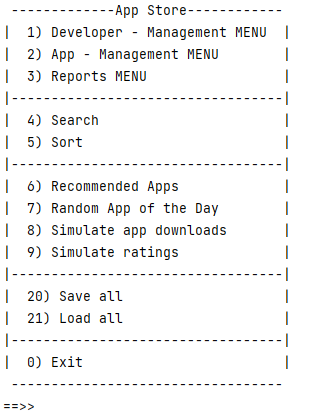
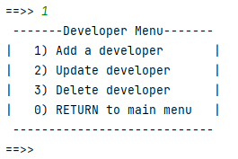
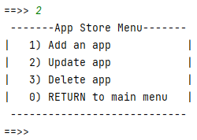
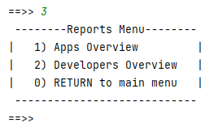

#Overview

Your are tasked with developing an **App Store** system.  It is a menu-driven, console app that can store apps of the following type:

- EducationApp
- GameApp
- ProductivityApp

An app can only be added for existing Developers.  

The information entered via the app will be persisted in XML files.

---

#Coding the Assignment

You will be provided with starter UML for the **App** inheritance hierarchy and for the other classes in the system.  You can augment these classes by adding your own additional fields and methods to them.

---

##Suggested Menu(s)

We have provided a suggested main menu below, however, depending on how you augment your starter classes, this menu will change.  Please feel free to deviate from it in any way you wish.

####Main Menu

We have also provided suggested sub-menus, however, you can choose to design your driver class in any way you wish. 

####Developer Menu

####App Menu

####Reports Menu

