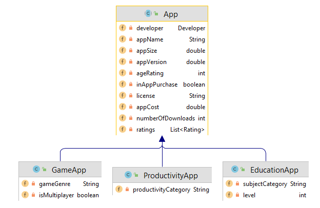

#Classes Overview

The System has the follwing *src* classes:

-----

##Code that is completed; just add them to your project:

- [Utilities](archives/Utilities.java)
- [ISerializer](archives/ISerializer.java)
- [ScannerInput](archives/ScannerInput.java)

##What you need to develop:

- controllers:
    - AppStoreAPI
    - DeveloperAPI

- main:
    - Driver

- models
    - App
    - Developer
    - EducationApp
    - GameApp
    - ProductivityApp
    - Rating

 - utils
     - CategoryUtilities
     - LicenceUtility
     - RatingUtility

For all classes, methods and  variables, please adhere to the naming standards discussed in class.

-----

#App hierarchy

| Class Name  |              Type               | Responsibility                                    |
| :---------- | :-----------------------------: | :------------------------------------------------ |
| App    |      Super Class, Abstract      | Manages the common information relating to an App i.e. app name, app version, a collection of ratings for an app, etc. |
| GameApp | Sub Class of App, Concrete | Manages the specific information relating to a Game App i.e. game genre and multiplayer. |
| ProductivityApp | Sub Class of App, Concrete | Manages the specific information relating to a Productivity App i.e. the category, such as Notes, Utility, etc |
| EducationApp  | Sub Class of App, Concrete | Manages the specific information relating to a Education App i.e. the level the app is aimed at (1-10) and the subject category |

-----

#Remaining Model Classes

| Class Name   | Responsibility                                               |
| :----------- | :----------------------------------------------------------- |
| Developer       | The responsibility for this class is to store a Developer i.e. a developer has a name and a website.  |
| Rating       | The responsibility for this class is to store a Rating i.e. a rating has a number of stars, a rater name and a rater comment. |

#API and Main Classes

| Class Name   | Responsibility                                               |
| :----------- | :----------------------------------------------------------- |
| Driver       | The responsibility for this class is to manage the User Interface (UI) i.e. the menu and user input/output.  This class should be the only class that has System.out.println() or Scanner reads in it.  This class contains an object of AppStoreAPI and an object of DeveloperAPI. |
| AppStoreAPI  | The responsibility for this class is to store and manage a list of Apps.  Note that App is the super class in the hierarchy pictured above, so any subclass objects can be added to this list of Apps e.g. an object of GameApp can be added to it. |
| DeveloperAPI  | The responsibility for this class is to store and manage a list of Developers.  Apps can only be added for Developers that exist in this list. |

#Utils Classes

| Class Name   | Responsibility                                               |
| :----------- | :----------------------------------------------------------- |
| LicenceUtility    | This class contains and manages a Map of permitted licenses for an App.  More details on this in a later section. |
| RatingUtility    | This class generates a random rating for an app.   More details on this in a later section. |
| RatingUtility    | This class contains and manages Sets for subjectCategories (for Education Apps), gameCategories (for Game Apps) and productivityCategories (for productivityApps).   More details on this in a later section. |
| ScannerInput | This [ScannerInput](archives/ScannerInput.java) class should be used for all user input. |
| Utilities    | This [Utilities](archives/Utilities.java) class contains utility methods used throughout the system in multiple classes.  |
| ISerializer    | This  [ISerializer](archives/ISerializer.java) interface is implemented by both the AppStoreAPI and DeveloperAPI for XML persistence in these classes.  |

NOTE: There should be absolutely *NO* **System.out.println** or **Scanner** reads in any class except for Driver and ScannerInput.  If you have any such interaction with the user in any other class, you will lose marks.  You should be returning information back to Driver to print it.  Or passing information read in Driver to other classes via method parameters.

---

#Similar Project: SocialNetworkV9.0

The solution for [Social Network V9.0](archives/SocialNetworkV9.0.zip).

- Inheritance Hierarchy with Abstraction and Polymorphism
- Use of ISerializer Interface
- Basic Utilities class
- JUnit testing of Inheritance Hierarchy and NewsFeed (the API class)

#Similar Project: ShopV8.0

The solution for [Shop V9.0](archives/ShopV9.0.zip).

- Sorting
- Searching
- Basic Utilities class
- LanguageUtility (specific utility for managing and validating a HashSet of permitted languages).
- JUnit - LanguageUtilityTest (JUnit for testing the above utility).
- JUnit testing of Store (the API class).

