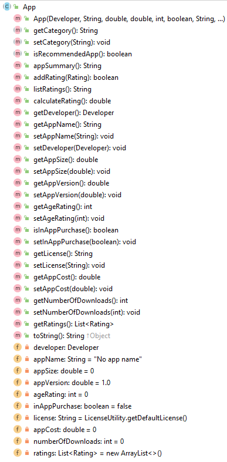

#App class

The responsibility for this *abstract* class is to manage an App.  The UML is here:

NOTES: 

- You may add additional instance fields of your choice.  If you do so, the method list and parameters for existing methods will change/grow.  
- The **Hierarchy Overview** tab has generic information on coding constructors, getters, setters and toString.  The information below is just the specifics related to this class.

---

#Fields

There are 10 private fields in the Employee class:

- **developer** : the provider has to be registered to add an app (handled in the Driver)
- **appName** : must be unique in the system (regardless of case - handled in Driver).  Default value "No app name"
- **appSize** : measured in MB - range from 1 to 1000 inclusive.  Default value 0
- **appVersion** : version number >= 1.0.  Default value 1.0.
- **ageRating** : min age for app - range from 0 to 18 inclusive.  Default value 0
- **inAppPurchase** : no validation. default value false
- **license** : must be a valid license. Default license if none supplied. (see LicenseUtility class)
- **appCost** : zero or more...no upper limit.  default value 0
- **numberOfDownloads** : downloads per app - handled programatically, starts at zero
- **ratings** : contains all ratings...overall rating calculated from arraylist

#Constructor Signature:

~~~
    public App(Developer developer, String appName, double appSize, double appVersion, int ageRating, boolean inAppPurchase, String license, double appCost) 
 
~~~

#Abstract methods

There are three abstract methods in this class (the three concrete classes will provide the implementation):

- getCategory()
- setCategory(String category)
- isRecommendedApp()

The return types for these methods can be read from the UML structure above.

#appSummary method

This method should build a, one line string containing the following information and return it (note: no \n should be included in the String):

- app name
- app version
- developer
- app cost
- number of downloads
- overall rating value (see: calculateRating method below)

#Rating methods

This class has an ArrayList of Ratings.  We need to provide the CRUD methods for this collection here. The following methods are required:

- addRating(Rating) - add a rating to the **ratings** ArrayList. 
  To improve the Rating system, you should write a 'RatingUtility' class that builds in allowed ratings. 
- listRatings() - build a string containing all the ratings and return it.  If no ratings have been added yet, return "No ratings added yet".
- calculateRating() - if no ratings have been added yet, return 0.  If ratings have been added, calculate the average value of the *numberOfStars* and return it.  Note: if a rating has a value of 0 for *numberOfStars*, this should not be included in the calculation.  

#JUnit Test Class

The Test Class for App is given [here](archives/AppTest.java)