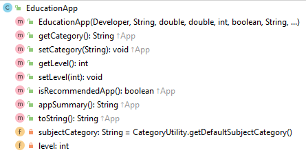

#EducationApp class

The responsibility for this *concrete* class is to extend App and implement the class for an EducationApp.  The UML is here:

NOTES: 

- You may add additional instance fields of your choice.  If you do so, the method list and parameters for existing methods will change/grow.  
- The **Hierarchy Overview** tab has generic information on coding constructors, getters, setters and toString.  The information below is just the specifics related to this class.

---

#Fields

There are two private fields in this class:

- *level* : This is the education level the app is aimed at.  It should be between 1 and 10 (both inclusive). Default value is 0.
- *subjectCategory* : this field uses the CategoryUtility for validation.  If a valid subject category is not supplied, the default subject category should be used.  
  

#Constructor

There is one constructor for this class. 

The parameter list for this constructor should be the same as the parameter list for the App class but with two additional fields (subjectCategory, level).  

The constructor should call the superclass constructor and also instantiate the other two fields (with validation).

#Abstract methods

- getCategory - this is simply a getter for the subjectCategory field
- setCategory - this is a setter for the subjectCategory field with the validation above included.
- isRecommendedApp - this is a more involved method and returns a boolean indicating if the app is recommended or not.  The algorithm for recommending an EducationApp is:

~~~
        // Algorithm - app is recommended if the following applies:
        //      inAppPurchase is false;
        //      appCost is > .99
        //      numberofDownloads >= 5
        //      rating of >= 3.5
        //      category is not the default of General
~~~

#JUnit Test Class

The Test Class for EducationApp is given [here](archives/EducationAppTest.java)

