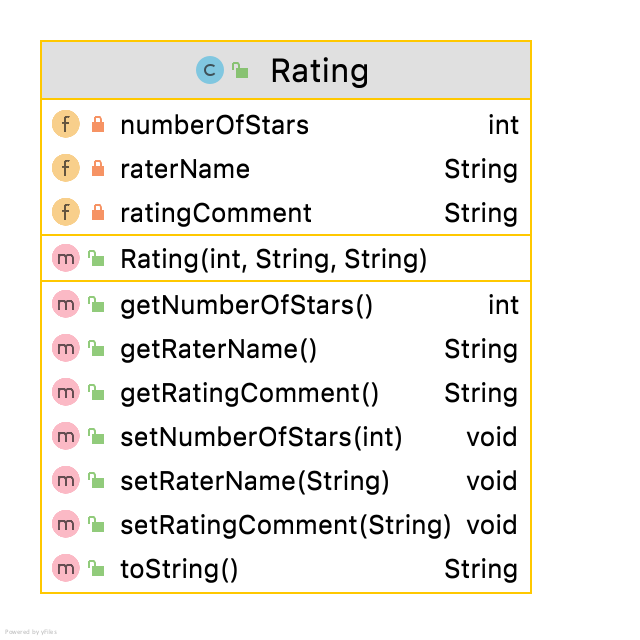

#Rating class

The responsibility for this class is to manage ratings for an App.  The UML is here:

NOTES: 

- Should you wish, you may add additional fields to this class.  As you add additional instance fields of your choice, your method list and parameters for existing methods, will change/grow.  The following descriptions are based on the starter UML above.

#Fields

There are 3 private fields in the Rating class:

- **numberOfStars** : the number of stars (1 - 5), default 0.
- **raterName** : the name of the  rater - max 20 chars; default "`<rater name`>"
- **ratingComment** : comment (optional); default "`<no comment`>"

  

---

#Constructor

There is one constructor that should take in three parameters for the following field:

- number of stars (1-5)
- rater Name (Validated as per RatingUtility)
- rating comment (Validated as per Rating Utility)

#Methods: 

The remaining methods are standard, remembering to implement the validation rules as specified. 

---

#JUnit Test Class

You are asked to write the Test Class for Rating.