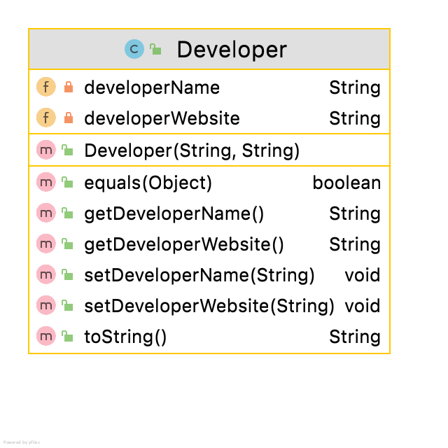

#Developer class

The responsibility for this class is to manage the details for the developer of  an App. The developer must be 'registered' (i.e. added to developer list) from the Driver menu to allow the developer's name to be used in an app's details.  The (starter) UML is here:

NOTES: 

- Should you wish, you may add additional fields to this class.  As you add additional instance fields of your choice, your method list and parameters for existing methods, will change/grow.  The following descriptions are based on the starter UML above.

  

---

#Fields

There are two private fields in the Developer class:

- *developerName*: The developer's name -  max 30 chars default value is "`<no developer`>"
- *developerWebsite*: The url is the developer's website - defaults to "`\<no website`>" otherwise validate as url. 

#Constructor

There is one constructor that should take in two parameters for the following fields:

- developerName (max 30 characters)
- developerWebsite (validate as url)

#Methods:

The remaining methods are standard, remembering to implement the validation rules as specified. 

#JUnit Test Class

The Test Class for Developer is given [here](archives/DeveloperTest.java)