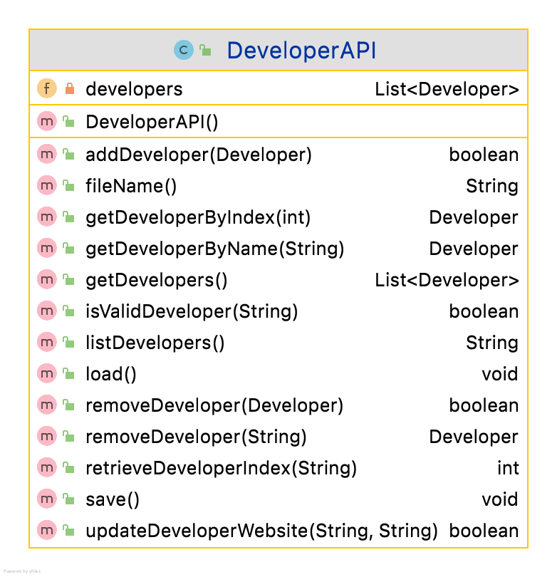

#DeveloperAPI class 

This API class is responsible for storing and managing ALL the developers in the system.  The **starter** UML is here:

NOTES: 

- There are no System.out.println statements in this class, nor are there any Scanner reads; all the I/O is in the other controller class, the *Driver* (and the utility classes, if you are using them).

- The methods listed above are only some of the methods that you will probably require to complete the assignment.  The methods that you will add to this class will depend on the menu items that you include in the Driver class.  

---

#Fields

There is one private field, *developers*, which is an List of Developer. 

#Constructor

The constructor should instantiate the developers ArrayList.

#getter and setter methods

Write getters and setters as normal for all instance fields, with validation where appropriate. 

You are given the following code : [DeveloperAPi.java](archives/DeveloperAPI.java)
This should be complete but it is up to you to ensure that it it complete.

NOTES: 

- There are no System.out.println statements in this class, nor are there any Scanner reads; all the I/O is in the other controller class, the *Driver* (and the utility classes, if you are using them).

- The methods listed above are only some of the methods that you will probably require to complete the assignment.  The methods that you will add to this class will depend on the menu items that you include in the Driver class.  

---

You should write a Test Class for DeveloperAPI.

---
