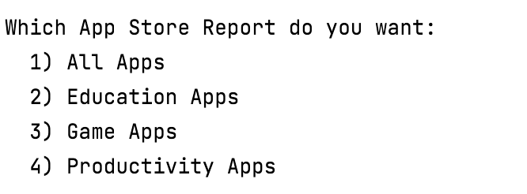
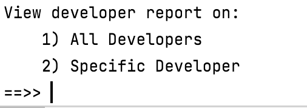

#Driver class

The responsibility of the Driver class is to run the app and perform I/O with the user.   

##Menu

A suggested menu is using a layered approach, so the highest level menu is

Then the Developer menu will look like : 

The App menu will look like 

The Reports Menu will look like : 

The Apps Overview will look like: 

The Developers Overview will look like : 

When writing this class, the above menu is just a suggestion.  You may deviate from this menu as you wish.  If you provide more elaborate menu items/reports, you will need to add more methods to the DeveloperAPI and/or AppStoreAPI class.

If you do deviate from the suggested menu, ensure that you still have the following basic elements on the menu:

- CRUD on the Employee list
- reporting and
- persistence

##A note on I/O

Aside from the ScannerInput class (if you are using it),  this class should be the only class that has:

- System.out.print statements
- ScannerInput objects defined/used. 

##Methods for Driver
Each item on the menu will typically have a private method associated with it in the Driver.  For example, for the menu option "Add an employee (manager)", a good associated method would be called **private void addManger()**.  

The appropriateness and clarity of the naming structures will be marked under the **Structure of Code** heading. 

This UML will grow based on the menu items you choose to add:

##Fields

There are two private fields in the *Driver* class:

- **developerAPI**:  This is an object of the DeveloperAPI class. 
- **appStoreAPI**: This is an object of the AppStoreAPI class. 

