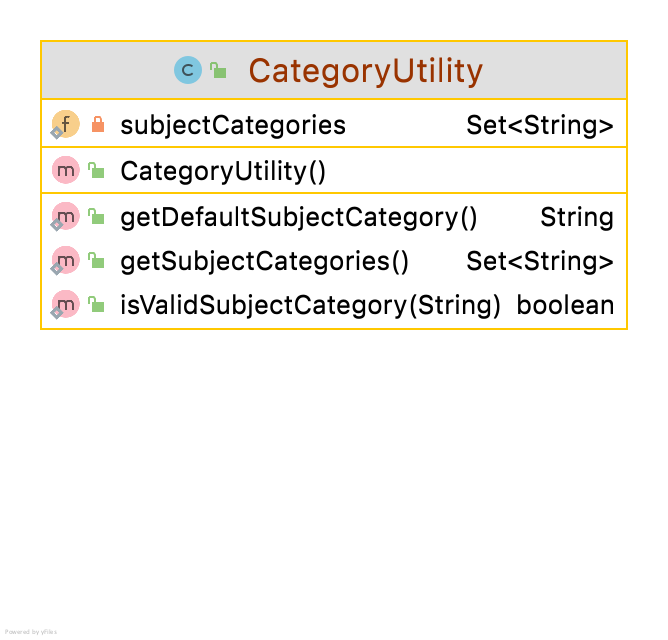
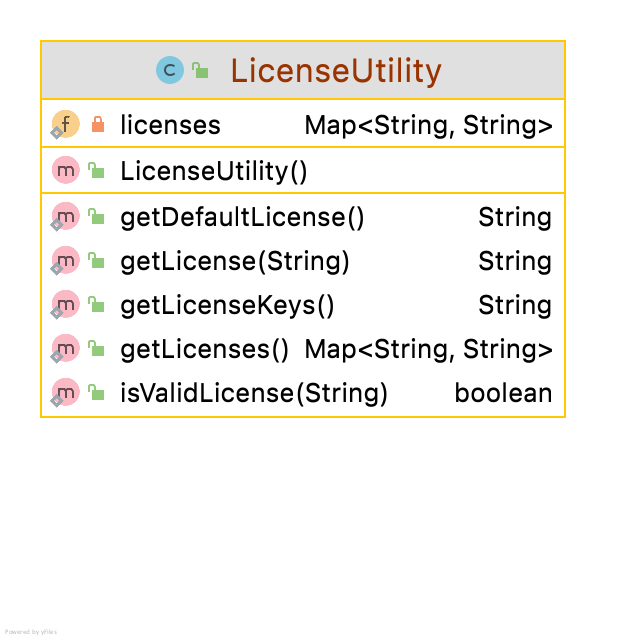
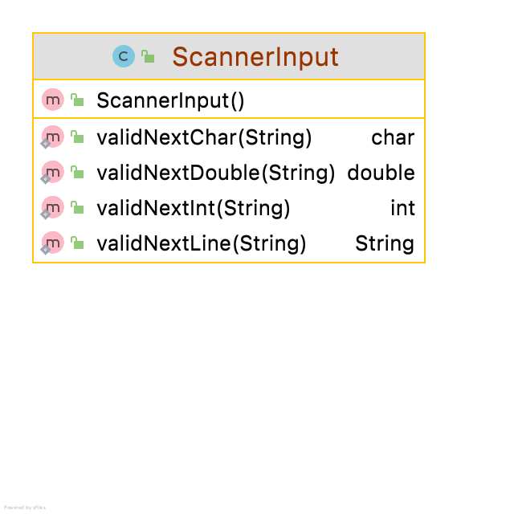

#Utils Package
The utils package contains collections of utilities, grouped by function. You can choose to validate without the use of these packages but it will be more time consuming and you will lose marks. 

## Utilities
We are giving  you  code for [Utilities.java](archives/Utilities.java).  The responsibility for the class is to store the reusable Utility (general) methods in one area.  

The test for these Utilities is available here: [UtilitiesTest.java](archives/UtilitiesTest.java)

## CategoryUtility

You are given  code here : [CategoryUtility.java](archives/CategoryUtility.java).  The given code gives you a structure to manage the validation of categories for the EducationApp's.
You should add in the methods to manage the validation for the GameApp and ProductivityApp.

##LicenseUtility
You are given the code here [LicenseUtility.java](archives/LicenseUtility.java)
This gives you methods to validate valid software license versions.

##RatingUtility
This should be written as per the other (given) Utility methods It can be used to manage the validation of ratings, authors, comments, authors.

Valid authors names (that work with our tests)
 - John Doe
 - Jane Doe

Valid comments (that work with our tests)
 - "Loved the UX"
 - "Excellent"
 - "Great App"
 - "Poor App"
 - "Couldn't stop using app"
 - "Used once, never again"
 - "Too expensive"
 - "Too slow"
 - "Really intuitive"
 - "Not for me"

##ScannerUtility
The code for ScannerUtility is given here [ScannerInput.java](archives/ScannerInput.java). It is as used up to now in the module and the UML is: 

##ISerializer
You should include ISerializer in your assignment.It is as discussed in class and can be used when designing AppStoreAPI and DeveloperAPI. 
The UML is 
