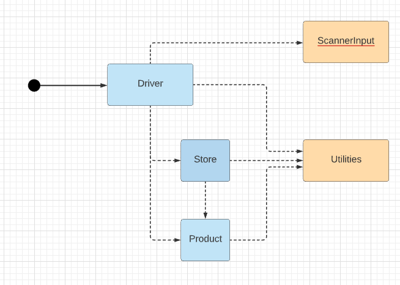

# Similar(ish) Projects

In your previous labs, you worked on a Shop project.  Your assignment will be similar(ish) to this project but will incorporate more concepts and require you to develop your own algorithms to solve some of the requirements given to you.

The solution to the Shop V5.0 project can be found [here](archives/ShopV5.0.zip).

The class diagram of the Shop Project is:

The folder structure of this project is:

The *responsibility* of the *Product* class is to manage a single product. 

The *responsibility* of the *Store* class is to manage an ArrayList of Products.

The *responsibility* of the *Driver* class is to manage the I/O with the console (including the menu).

The *responsibility* of the *ScannerInput* class is to manage the individual reading of int, double, char and strings from the console. 

The *responsibility* of the *Utilities* class is to hold all the generic utility methods that we use for validation etc in our projects.

Please use this code as a support for developing your NoteKeeper app.

