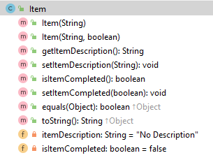

# Item class

The responsibility for this class is to manage a single Item in the system.  An item belongs to a specific Note. 

**Remember, as soon as you enter the fields in a class in IntelliJ, you can GENERATE getters, setters, constructors and toString methods.  They are only basic methods and may need to be modified e.g. to add validation, change the format of the generated toString, etc.**

---

# Fields

There are two private fields in the Item class:

- *itemDescription*: The description is maximum 50 characters.  When creating a new item, if the string is longer than 50 characters, you shoud truncate the string to the first 50 chars (**Hint** see Utilities for a useful method to do this)   When updating itemDescription, you should only update if the value is less than or equal to 50.  

- *isItemCompleted*: A boolean value, set to false for every new item (unless the two parameter constructor is used). 

**Hint: you can use Utilities validation methods to perform the above validation (see Utilities tab for more information).  We have provided some methods, but you would need to write more.**

---

# Methods

- Ensure that the constructor and mutators adhere to the validation rules listed above.  

- Sample output from the toString is below (note how the boolean value for isItemcompleted is set to either TODO or Completed when printing to the console):

---

#JUnit Test class

The test class for Item  [is here](archives/test/ItemTest.java).