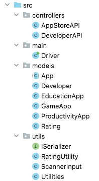
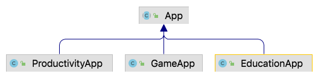

# Classes Overview

The System has the follwing *src* classes:

## Create a New Project

Create a new project in IntelliJ now and add the below starter code to it, adhering to the package structure pictured above.  

When you have the code added:

- run the Driver menu and familiarise yourself with the menu.
- familliarise yourself with the code given to you.
- familiarise yourself with the TODO comments in the code.  All the information required to complete the TODO comments are in this spec.  You should read through the spec now, so that you have a good handle on what you need to do. 

---

## Classes that are completed:

| Class Name   | Responsibility                                               |
| :----------- | :----------------------------------------------------------- |
| [Developer](archives/Developer.java) | The responsibility for this class is to store a Developer i.e. a developer has a name and a website.  |
| [DeveloperAPI](archives/DeveloperAPI.java)  | The responsibility for this class is to store and manage a list of Developers.  Apps can only be added for Developers that exist in this list. |
| [Rating](archives/Rating.java)       | The responsibility for this class is to store an individual Rating for an app i.e. a rating has a number of stars, a rater name and a rater comment. |
| [RatingUtility](archives/RatingUtility.java)  | This class generates a random rating for an app, from a list of pre-populated authors and comments |
| [ScannerInput](archives/ScannerInput.java) | This is the same class from Assignment 1 and should be used for all user input. |
| [Utilities](archives/Utilities.java)  | This class contains utility methods used throughout the system in multiple classes.  |

---

## Classes that are partially completed:

| Class Name   | Responsibility                                               |
| :----------- | :----------------------------------------------------------- |
| [Driver](archives/Driver.java) | The responsibility for this class is to manage the User Interface (UI) i.e. the menu and user input/output.  This class should be the only class that has System.out.println() or Scanner reads in it.  This class contains an object of AppStoreAPI and an object of DeveloperAPI. |
| [AppStoreAPI](archives/AppStoreAPI.java)  | The responsibility for this class is to store and manage a list of Apps.  Note that App is the super class in the hierarchy pictured below, so any subclass objects can be added to this list of Apps e.g. an object of GameApp can be added to it. |

---

## An Interface that you need to include is:

| Interface Name | Responsibility                                               |
| :------------- | :----------------------------------------------------------- |
| [ISerializer](archives/ISerializer.java)    | This interface is the same as that used in lectures and labs.  It should be implemented by both the AppStoreAPI and DeveloperAPI for XML persistence in these classes.  |

---

## Classes that you need to write from scratch (i.e. the Inheritance Hierarchy):

| Class Name  | Type                                    | Responsibility                                          |
| :---------- | :-------------------------------------: | :------------------------------------------------------ |
| App    |      Super Class, Abstract      | Manages the common information relating to an App i.e. app name, app version, a collection of ratings for an app, etc. |
| GameApp | Sub Class of App, Concrete | Manages the specific information relating to a Game App i.e. multiplayer. |
| ProductivityApp   | Sub Class of App, Concrete | Manages the specific information relating to a Productivity App - in this case, we have no additional fields |
| EducationApp  | Sub Class of App, Concrete | Manages the specific information relating to a Education App i.e. the level the app is aimed at (1-10) |

---